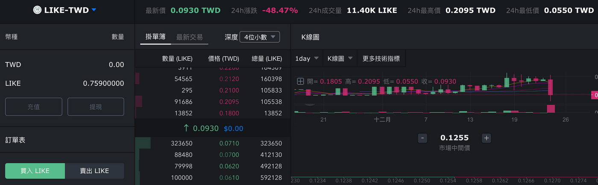
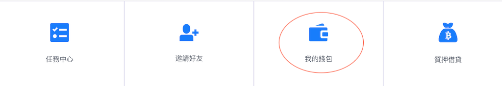
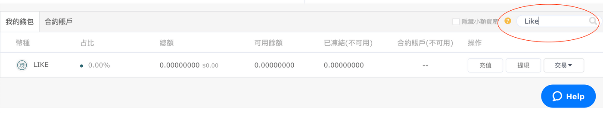
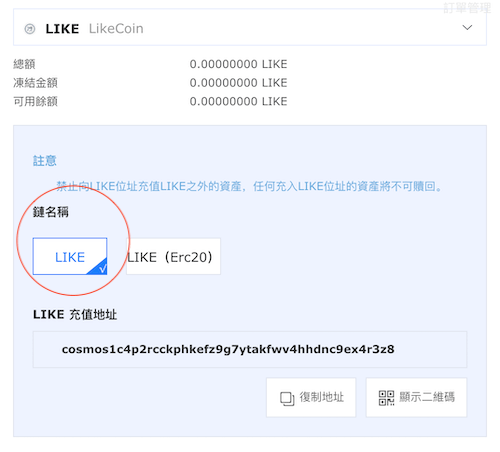
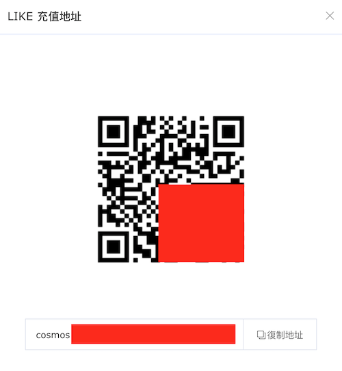
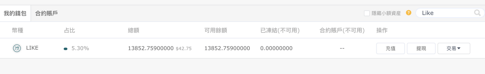
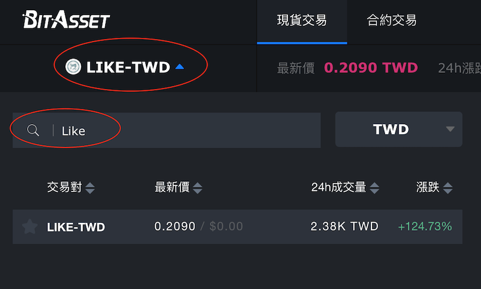
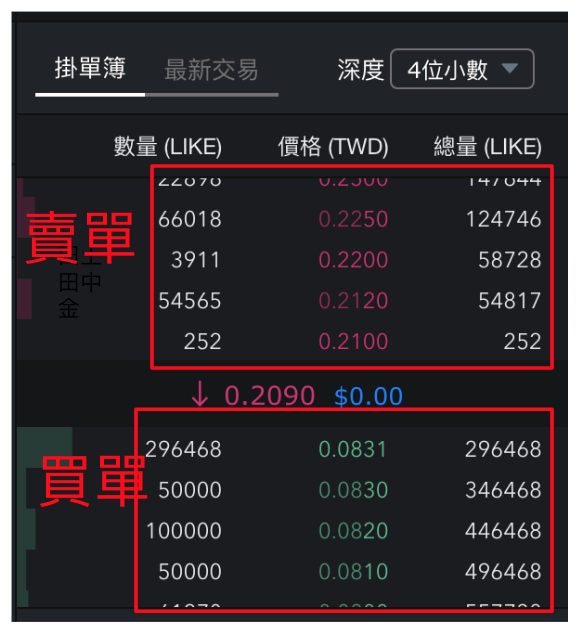
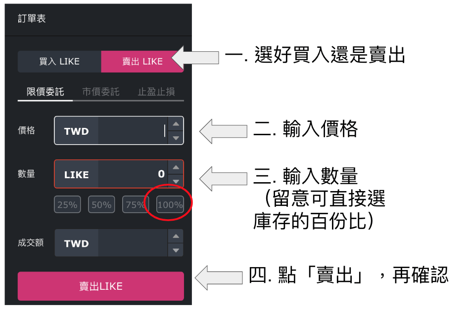
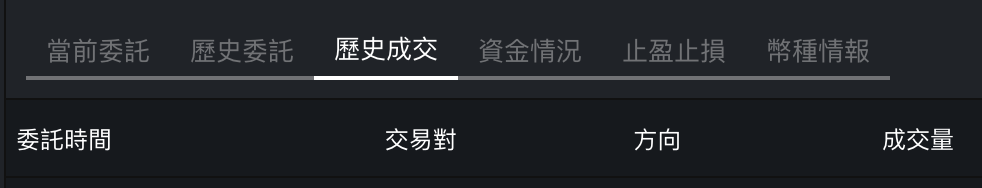

# 在 BitAsset 交易

若想把 LikeCoin 兌換成台幣或 BTC，目前最方便的方法是經過 [BitAsset](https://www.bitasset.com/) 交易所，因為他們直接提供了 LIKE/TWD 的交易對。若你還未有 BitAsset 帳號，[請參考這篇](https://docs.like.co/v/zh/user-guide/likecoin-token/registering-on-bitasset)。另，你也需要已[下載 Liker Land 手機應用程式](https://like.co/in/getapp)，用來傳送/提取 LikeCoin。

### 步驟一：找到 BitAsset 帳戶的 LikeCoin 錢包地址

第一步要把你的 LikeCoin 轉賬到 BitAsset 交易所，那當然要先找到轉賬地址才行。

請登入 [BitAsset](https://www.bitasset.com/) 的網站，登入後點選右上角自己的用戶電郵/ID，再點「用戶」欄進入帳戶介面。點下方「我的錢包」進入 BitAsset 帳戶錢包介面。

在帳戶錢包介面的下方會列出你名下不同貨幣的錢包，雖然琳瑯滿目但可惜大部份的餘額都是 0（悲但真）。直接在右上方輸入 "LIKE" 尋找 LikeCoin 的錢包。雖然目前餘額還是 0，但很快便會改變了。立即充值！

點「充值」鍵進入下方畫面，請在「鏈名稱」部份選 「LIKE」，代表你將轉賬的是2019年11月15日升級到 LikeCoin chain 後的新版本 LikeCoin。下方會立即出現 cosmos 開始的一串長長的地址。什麼？要使用這串複雜的地址？模樣好嚇人啊！

感謝世上有二維碼。請點右下方的「顯示二維碼」按鍵。

你會看到下圖的二維碼，那便是你 BitAsset 帳號中的 LikeCoin 錢包地址了。


留意 BitAsset 充值 LikeCoin 設有單筆最小充值量，_**未達此金額的存款將直接消失掉！**_大家務必看清楚才轉帳啊。有關單筆最小充值量、單筆最小提現量及提現手續費等可參看 [BitAsset 費率標準](https://bitasset.zendesk.com/hc/zh-tw/articles/360028459212-%E8%B2%BB%E7%8E%87%E6%A8%99%E6%BA%96)。


### 步驟二：轉帳 LikeCoin 到 BitAsset

過程就跟 PayMe 或 Line Pay 差不多。打開 [Liker Land 手機應用程式](https://like.co/in/getapp)，在畫面右下角選錢包介面，你會在這裡查到自己口袋裡有多少錢。點畫面上的「轉帳」 / \[Send\] 鍵（下圖紅圈位置）。

![&#x5728; Liker Land &#x624B;&#x6A5F;&#x61C9;&#x7528;&#x7A0B;&#x5F0F;&#x9322;&#x5305;&#x4ECB;&#x9762;&#x9078; \[Send\]&#xFF08;&#x7D05;&#x5708;&#xFF09;](../../.gitbook/assets/bitasset-trade-6.png)

進入下一頁後，點下圖紅圈位置的二維碼圖示。app 會跳進照相機介面讓你掃描二維碼，請掃描【步驟一】中你的 BitAsset 帳戶 LikeCoin 錢包的二維碼，因為你想要轉錢到 BitAsset。 

輸入你想要轉帳的 LikeCoin 金額，然後點擊「確認」 / \[Confirm\]。

轉帳指示已發出，過程不用兩分鐘，很方便對吧？過去 LikeCoin 還是 ERC-20 版本時，要付以太幣作手續費及用 MetaMask 錢包轉帳的時代已經過去了。

接下來便要等 BitAsset 那邊確認收款了。

### 步驟三：確認 BitAsset 收款

這是一個令人緊張的時間，因為錢轉出去了，但又不知對方有沒有收到；這刻心中又不免會想：剛才有沒有做錯了什麼，錢轉錯了地址轉到黑洞帳號去了呢⋯⋯

幸好 BitAsset 存款 LikeCoin 的效率還不錯，剛剛實測不到 5 分鐘錢便到帳了。你可以在「我的錢包」中按【步驟一】的方法查詢餘額。

### 步驟四：選個好價錢買入/賣出

未操作過股票買賣或外幣買賣的朋友，來到真正令人捏一把汗的環節了，因為畫面上又紅又綠的數字和圖表，還有小數點後長長的數字串，看得頭也快暈了，是嗎？

不用怕，跟著以下幾個步驟做便好了，詳細再慢慢了解吧！

首先，點左上方的「現價買賣」選項。畫面會切換成紅紅綠綠鋪滿數據。在畫面的左上方輸入 "LIKE"，右邊再選 "TWD"（台幣）或 "BTC" （比特幣），視乎你想把 LikeCoin 兌換成什麼貨幣。

選好交易對後，看一看畫面中部的「掛單簿」\( order book \)。上方紅色列出的是掛出在市場上的「賣單」，以下圖的例子舉例，有人願意以 0.21 TWD/LIKE 的價格賣出 252 LikeCoin，然後再有人願意以 0.212 TWD/LIKE 的價格賣出 52,565 LikeCoin。假設你想買入 50,000 LikeCoin，你便可以最高價 0.212 TWD/LIKE 的價格全數買入。

同樣道理，若你想賣出 LikeCoin ，你便要觀察「買單」找買家。以下圖為例，假設你想要賣出 50,000 LIKE，可保證以 0.0831 TWD/LIKE 的價格賣出，因為目前有人出的最高價是 0.0831 購 296,468枚 LikeCoin。

心中決定了買賣的價錢和數量後，在左下方的「訂單表」下單，這裡我以「限價委託」為例子說明。

你需要輸入三個資料：

1. 確認選對了「買入 Like」或「賣出 Like」，這一步很多時候也會被忽略了然後做錯事
2. 輸入價格。以上圖的掛單簿為例，若我想賣出 LikeCoin 這裡應填上 "0.0831"
3. 輸入數量。若我想賣出 50,000 LikeCoin 這裡應填上 50000。你也可以簡單一點選擇庫存的百份比，例如 100%，50% 等

資料填妥後，系統會自動計算成交額。確認無誤後，點擊「賣出 LIKE」，操作完成！

### 步驟五：查看交易詳情

交易完成後，你可在畫面下方說「歷史成交」，查看交易的詳情，你的錢包也會反映餘額。

#### BitAsset 官方教學

> [BitAsset 使用全攻略
](https://bitasset.zendesk.com/hc/zh-tw/articles/360012894432-BitAsset-%E4%BD%BF%E7%94%A8%E5%85%A8%E6%94%BB%E7%95%A5)

> [BitAsset APP 使用全攻略](https://bitasset.zendesk.com/hc/zh-tw/articles/360018349812-BitAsset-APP-%E4%BD%BF%E7%94%A8%E5%85%A8%E6%94%BB%E7%95%A5)

> [BitAsset新手指南－交易篇](https://medium.com/bitasset/bitasset%E6%96%B0%E6%89%8B%E6%8C%87%E5%8D%97-%E4%BA%A4%E6%98%93%E7%AF%87-f1f83f555520)

> [法幣提現操作
](https://bitasset.zendesk.com/hc/zh-tw/articles/360018396472-%E6%B3%95%E5%B9%A3%E6%8F%90%E7%8F%BE%E6%93%8D%E4%BD%9C)

#### 參考文章

> [BitAsset 買賣 LikeCoin \(台幣\)，提現到台幣帳戶補充分享
](https://matters.news/@yeutorng/bit-asset-%E8%B2%B7%E8%B3%A3-like-coin-%E5%8F%B0%E5%B9%A3-%E6%8F%90%E7%8F%BE%E5%88%B0%E5%8F%B0%E5%B9%A3%E5%B8%B3%E6%88%B6%E8%A3%9C%E5%85%85%E5%88%86%E4%BA%AB-zdpuAtaC5cMohnxfiSBGTBq5e41LpmqKLCLbCaJbk7osz5b5N)

> [「Matters实用贴」教你如何四步快速提现LikeCoin
](https://matters.news/@mrspointm/matters%E5%AE%9E%E7%94%A8%E8%B4%B4-%E6%95%99%E4%BD%A0%E5%A6%82%E4%BD%95%E5%9B%9B%E6%AD%A5%E5%BF%AB%E9%80%9F%E6%8F%90%E7%8E%B0like-coin-zdpuAobP3T9TaNV5yimGdr1w58Y5LzWRh19cXcVSepnsLf1wa)

> [用Liker Land APP在BitAsset交易所把 LikeCoin 兌換成台幣（手機執行）
](https://twinsyang.net/archives/21627)

