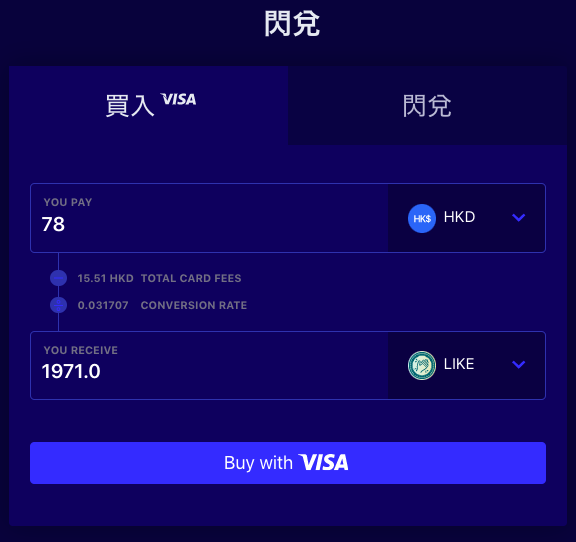
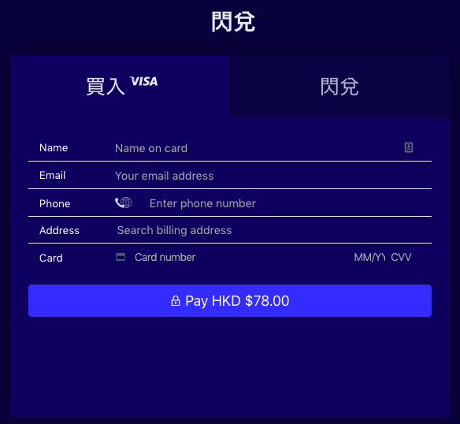

# Trade in Liquid

### Quick Exchange

[Quick Exchange ](https://app.liquid.com/quick-exchange)provides a simple interface for users to exchange LikeCoin.

**Please be reminded: The transaction amount affects the exchange rate, the system displays real time offers.**

### **Exchange LikeCoin with others cryptocurrency**

* On the Quick Exchange interface, select the "Swap" tab
* Select the type of currency that you would like to sell, select LIKE. If you would like to buy LikeCoin, select other cryptocurrency for example BTC/ETH/USDC/USDT
* On the "RECEIVE" field select the currency that you would like to get, rate is displayed instantly
* Fill in the amount to sell on the "EXCHANGE" field, if you do not have enough balance in your account, a warning will be displayed
* Fill in the amount to exchange, the system will show the amount that you can get on the "RECEIVE" field. If it's OK to you, click the "Quick Exchange'' button and the transaction is done. The exchanged amount will be credited to you account instantly.
* Or vice versa, fill in the amount of currency that you want to get, the system will show how much the amount of currency that you need to sell in the "EXCHANGE" field

### Purchase LikeCoin with credit card

只接受 VISA 信用卡

* 最低兌換額 78 港元 或 380 新台幣（約 10 美元）
* 系統會即時顯示信用卡手續費及兌換率。畫面顯示的貨幣獲得數量已是扣除費用後所獲得的數量

點擊 "Buy with VISA" 後，系統會要求你填寫信用卡資料，然後付款。


Liquid 不對數字貨幣及法定貨幣存款收取相應費用，而最低委託數量、最低提款金額及交易手續費等最新資訊可於 [Liquid 幫助中心（繁体中文）](https://help.liquid.com/en/collections/1490333-liquid-%E5%B9%AB%E5%8A%A9%E4%B8%AD%E5%BF%83-%E7%B9%81%E4%BD%93%E4%B8%AD%E6%96%87)參看


