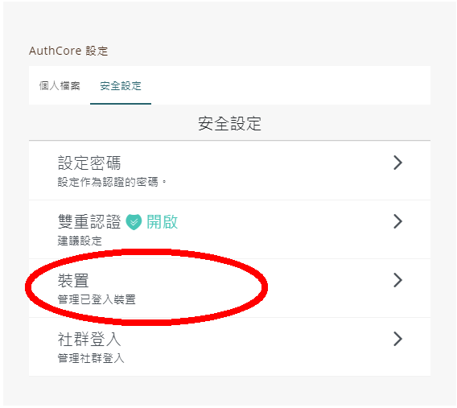

# Manage logged in devices

You can see computers, phones, and other devices that are currently using or have recently used your Liker ID. You can check this info to make sure no one else has signed in to your account.

Login [Liker Land](https://liker.land/) and go to [https://like.co/in/settings](https://like.co/in/settings), go to AuthCore Settings, click "Security settings", or open the Liker Land mobile app, click on the avatar at the lower right hand corner and select \[Account Settings\], then click "Devices".

"Manage devices" shows all the devices currently logged in your Liker ID, you can click on one of the device and click "Log Out", or click "Log out all other devices" to log out all devices.


To help keep your Liker ID secure, sign out on devices that:

* Are lost or you no longer own
* Don't belong to you


