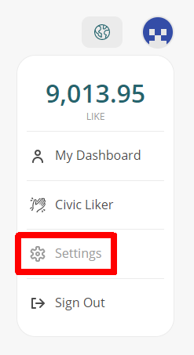

# 修改頭像及顯示名稱

### 修改方法

#### 網頁版

在 [Liker Land](https://liker.land/) 登入 [Keplr Browser Extension](../../guides/wallet/keplr/) 後，點 Settings。

<figure><figcaption></figcaption></figure>

彈出視窗，點「更改頭像」及修改「顯示名稱」。

<figure><figcaption></figcaption></figure>

#### 手機版

在 [Liker Land 手機應用程式](../liker-land/download.md)直接點頭像轉換新頭像。

<figure><figcaption></figcaption></figure>

於畫面右下角設定點選「個人資訊」再點「個人檔案」更改顯示名稱。

<figure><figcaption></figcaption></figure>

### 使用場景

修改完成後，你的資訊會在 Liker Land 的各種使用場景中顯示：

#### NFT Portfolio


[nft-portfolio.md](../../guides/writing-nft/nft-portfolio.md)


<figure><figcaption></figcaption></figure>

#### LikeCoin button 讚賞鍵


[creator](../creator/)


<figure><figcaption></figcaption></figure>

#### Liker Land 手機應用程式及網頁


[download.md](../liker-land/download.md)


#### LIKE pay


[like-pay.md](../../guides/wallet/like-pay.md)


