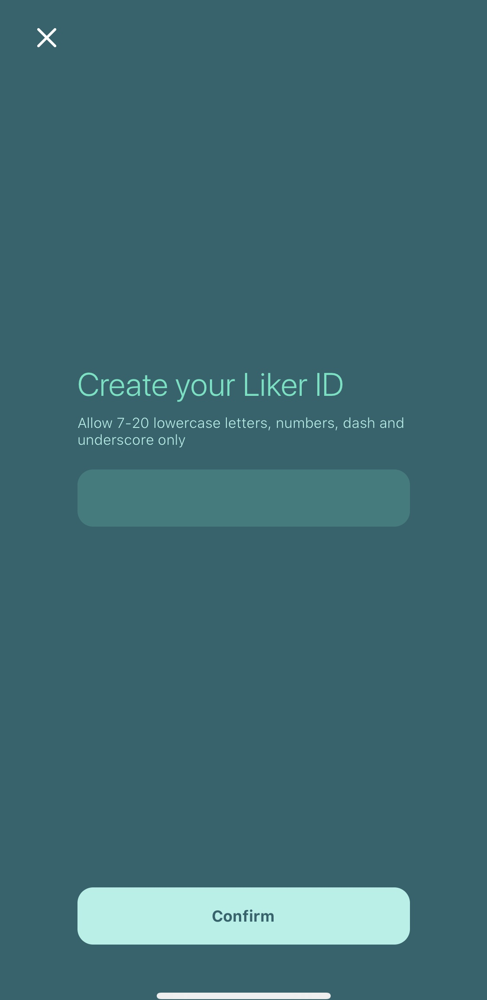

# Register a Liker ID

Registering a Liker ID is easy, just download [**Liker Land**](https://like.co/in/getapp) mobile app and follow the instruction below:

### Step 1: Open your Liker Land app，Press the "Sign Up" Button 

### **Step 2: Choose your Sign Up method**

We suggest you register with your social media accounts, which is safer and easier. Click on the social media icon e.g. If you would like to register with Google Account, click on the Google icon. If you want to register with Matters login, click on the Matters icon \( swipe right until the icon shows up\).

### Step 3: Fill in your account details

Fill in your social media account details, for example, if you have a Google Account, fill in your Gmail address and login password.

After successfully login your social media account, the following screen will appear. Please press "Register" and confirm that you are using this social media account to register your Liker ID.

After pressing "Register", the system will try to register with your social media account. You should be able to see the screen below if everythings works out smoothly. Press "OK" to confirm.

### Step 4: Create your Liker ID

One final step to go. After pressing the "OK" button, a green screen will appear as below and you can choose your favorite Liker ID. The system will suggest a Liker ID for your but if you are not happy with it, you can change it here. Fill in your Liker ID and press "Confirm" to finish the registration process.


Once a Liker ID has been created, it cannot be changed.  We suggest you to keep it, or just create another one.



What is Authcore?




