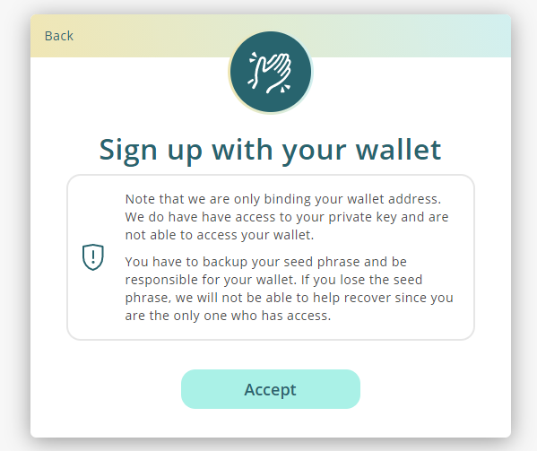

# Register a Liker ID with Keplr

Users can register a Liker ID with [Keplr](../../general-guides/wallet/keplr/) and manage their LikeCoin in a more decentralized way and keep their own private key at the same time. Choose "Sign in with your wallet" to sign up/login by Keplr. Note that users can choose either method ( Keplr or General Registration aka Authcore ) for Liker ID registration, the two login methods cannot be interchanged for a given Liker ID once it has been confirmed.

## **Comparison**

| **Register with Keplr**                                                                                                                                                            | **General Registration ( Authcore )**                                                                                                                                                     |
| ---------------------------------------------------------------------------------------------------------------------------------------------------------------------------------- | ----------------------------------------------------------------------------------------------------------------------------------------------------------------------------------------- |
| Must have knowledge on blockchain and cryptocurrency                                                                                                                               | Friendly user experiences                                                                                                                                                                 |
| User has to manage his/her own private key, it's safer                                                                                                                             | Manage the private key by Authcore secure and frictionless sign-in solution, easy to use. User may also export seed words and manage their own private key                                |
| Supports crypto currencies other than LikeCoin, such as ATOM, OSMO, AKT, CRO, KAVA, etc                                                                                            | Supports LikeCoin only                                                                                                                                                                    |
| Login with Keplr only                                                                                                                                                              | Login with [Social Accounts](register/social-media-logins.md) ( Google, Facebook, etc ) or email                                                                                          |
| Cannot bind with [Matters](https://matters.news) ID                                                                                                                                | Can bind with [Matters](https://matters.news) ID                                                                                                                                          |
| Can only login with Chrome Keplr extension on desktop computer                                                                                                                     | Login with [Liker Land app](https://liker.land/getapp) or mobile web                                                                                                                      |
| Support hardware wallet                                                                                                                                                            | Do not support hardware wallet                                                                                                                                                            |
| Need to enter the full wallet address during transfer                                                                                                                              | Enter recipient's Liker ID or wallet address in [LIKE pay](../../general-guides/wallet/like-pay.md)                                                                                       |
| Use [dao.like.co](https://dao.like.co/) to delegate LikeCoin                                                                                                                       | Use Liker Land mobile app or [dao.like.co](https://dao.like.co/) to [delegate](../../general-guides/stake/delegation-of-likecoin.md) LikeCoin                                             |
| Use [dao.like.co](https://dao.like.co/) to [deposit](../../general-guides/governance/proposal-deposit.md) or [vote](../../general-guides/governance/direct-vote.md) for a proposal | Use [dao.like.co](https://dao.like.co/) to [deposit](../../general-guides/governance/proposal-deposit.md) or [direct vote](../../general-guides/governance/direct-vote.md) for a proposal |
| Check rewards by transaction only                                                                                                                                                  | [Rewards](../creatortools/rewards.md) visualization from each piece of content on Liker Land app                                                                                          |
| Can register [ISCN](../../general-guides/decentralized-publishing/app.like.co.md) and buy [Writing NFT](../../general-guides/writing-nft/)                                         | Can register [ISCN](../../general-guides/decentralized-publishing/app.like.co.md) and buy [Writing NFT](../../general-guides/writing-nft/)                                                |


Users can manage LikeCoin with [Cosmostation](../../general-guides/wallet/cosmostation/), but cannot register a Liker ID with Cosmostation at the current moment.


## **How to register a Liker ID with Keplr**

### **Video Tutorial**



### **Step 1: Install Keplr extension**

Install the Keplr wallet before registering your Liker ID. If you have already completed the installation, please skip this step.


[how-to-install-keplr-extension.md](../../general-guides/wallet/keplr/how-to-install-keplr-extension.md)


### Step 2: Start Registering

Go to [https://liker.land/civic](https://liker.land/civic) and click "Register now".

<figure><figcaption></figcaption></figure>

Click "Sign Up" on the registration or login page.

<figure><figcaption></figcaption></figure>

### Step 3: Register with new or old interface

#### New Interface

The following page appears, click "Switch to new Interface".

<figure><figcaption></figcaption></figure>

Click "Connect Using Keplr Browser Extension".

<figure><figcaption></figcaption></figure>

The Keplr window pops up, click "Approvel".

<figure><figcaption></figcaption></figure>

Fill in your desired Liker ID then click "Confirm".

<figure><figcaption></figcaption></figure>

Enter your display name and bio and click "Confirm".

<figure><figcaption></figcaption></figure>

Liker ID is created and will bring back the login page.

#### Old Interface

On the top right hand corner, click "Sign in with your wallet".

<figure><figcaption></figcaption></figure>

Click "Sign up with Keplr".

Click "Accept".

The Keplr wallet LikeCoin chain Add Request pop-up, click "Approve".

Now you have to authorize the connection between Keplr and LikeCoin: On Requesting Connection window, click "Approve" to continue.

On the welcome screen, fill in your desired Liker ID and email address, then click "Confirm".

<figure><figcaption></figcaption></figure>

Liker ID is created and will bring back the login page.


You cannot change the Liker ID nor the login method once it has been created. If you want to have another Liker ID, just create a new account. Please note that **an email address or a a wallet address can only register one Liker ID**.

**You cannot use the same email address to register a Liker ID with both Authcore and Keplr.**


### Step 4: Check the Wallet

On Liker Land [settings](https://like.co/in/settings), your LikeCoin wallet address is the same as the Keplr address, which means that you have successfully registered your Liker ID with Keplr.

### Step 5: User Keplr to Login Liker Land

After registration, if you would like to login Liker Land again, please login Keplr and visit [https://liker.land/civic/dashboard](https://liker.land/civic/dashboard), then click "Sign in".

<figure><figcaption></figcaption></figure>

#### New Interface

Click "Connect Using Keplr Browser Extension" and login.

<figure><figcaption></figcaption></figure>

#### Old Interface

On the top right hand corner, click "Sign in with your wallet".

<figure><figcaption></figcaption></figure>

Click "Sign in with Keplr".

Click "Accept".

The Keplr wallet Chain Add Request pop-up, click "Approve" and you can login to Liker Land.


If you have more than one Liker IDs that registered by Authcore and Keplr, please make sure that you log out completely by clicking logout in the menu before sign in another account.


## Deposit LikeCoin to Keplr


[keplr](../../general-guides/wallet/keplr/)

