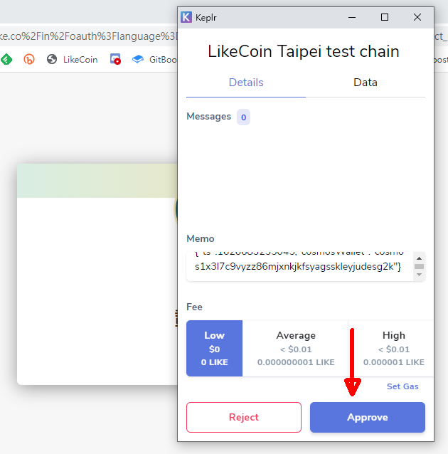

# Register a Liker ID with Keplr

Besides [registering with an email, GMail or Social Media Login](register.md), users can now register with Keplr and manage their LikeCoin in a decentralized way with their own private key. Registering with Keplr does not require email or any other personal details, users only have to use Keplr on sign up/login. Keplr only supports registering a new Liker ID at this moment.

### **Comparison**

| **Register a Liker ID with Liker Land** | **Register a Liker ID with Keplr** |
| :--- | :--- |
| Login with Social logins or email | Login with Keplr only |
| Manage the private key with Authcore secure and frictionless sig-in solution | User has to manage his/her own private key |
| User friendly user experiences | Must have some knowledge on blockchain and cryptocurrency |
| Login with Liker Land mobile app or mobile web | Can only login with Keplr extension on desktop computer |
| Supports LikeCoin only | Supports crypto currencies other than LikeCoin, such as ATOM, OSMO, AKT, CRO, KAVA, etc |
| Support transfer within the LikeCoin chain | Supports IBC \(Inter Blockchain Communication\) |
| Use Liker Land mobile app to delegate LikeCoin | Use stake.like.co to delegate LikeCoin |
| Enter receiver's Liker ID during LIKE pay | Need to enter the full wallet address during transfer |

### **Video Tutorial**



### **Step 1: Install Keplr extension**

Go to the Chrome Webstore and click "Add to Chrome" to install the [Keplr extension](https://chrome.google.com/webstore/detail/keplr/dmkamcknogkgcdfhhbddcghachkejeap).

Click and "Add extension" to Chrome / Brave.

After installation click on Keplr icon and the registration screen appears. Click and “Create new account”,

The 1st roll is the seed phrase. Find a secure place to encrypt and store the seed phrase as it is needed for account recovery.

Fill in your Account name, password and click "Next", after validating the seed phrase, the wallet interface of Keplr appears.


Please keep your seed phase and password in a safe place. If you forget them you are not able to manage your LikeCoin. No one can reset your wallet for you.


### Step 2: Register a Liker ID

On [Liker Land web](https://liker.land/), click "Sign up".

On the top right hand corner, click "Sign in with your wallet".

Click "Sign up with Keplr".

Click "Accept".

The Keplr wallet pop-up, clicks "Approve".

Fill in your desired Liker ID and email address, then click "Confirm".

Liker ID is created and will go back to the Liker Land web.

### Step 3: Check the Wallet

On Liker Land Web settings, your LikeCoin wallet address is the same as the Keplr address, which means you successfully register your Liker ID with Keplr.

### Step 4: Manage LikeCoin on stake.like.co

Go to [stake.like.co](http://stake.like.co) and click "Keplr Browser Extension".

Then click "Approve".

Click on "Approve" again.

You can see your balance.

Moreover, on the top menu of Keplr select "LikeCoin chain".

It shows your LikeCoin balance.

You may use Keplr to transfer LikeCoin directly. You may also manage your LikeCoin with [stake.like.co](https://stake.like.co) and Keplr together to transfer or delegate. Keplr also supports hardware wallets.

