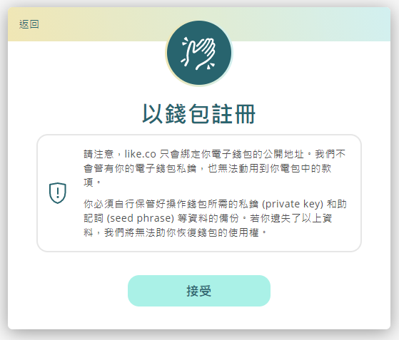
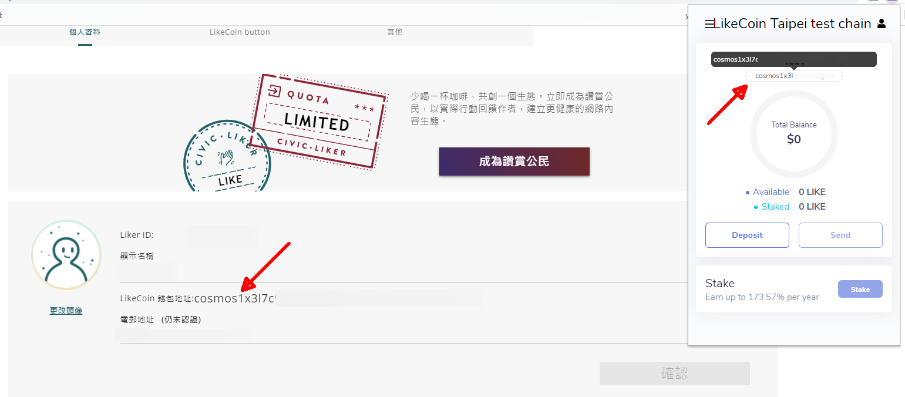
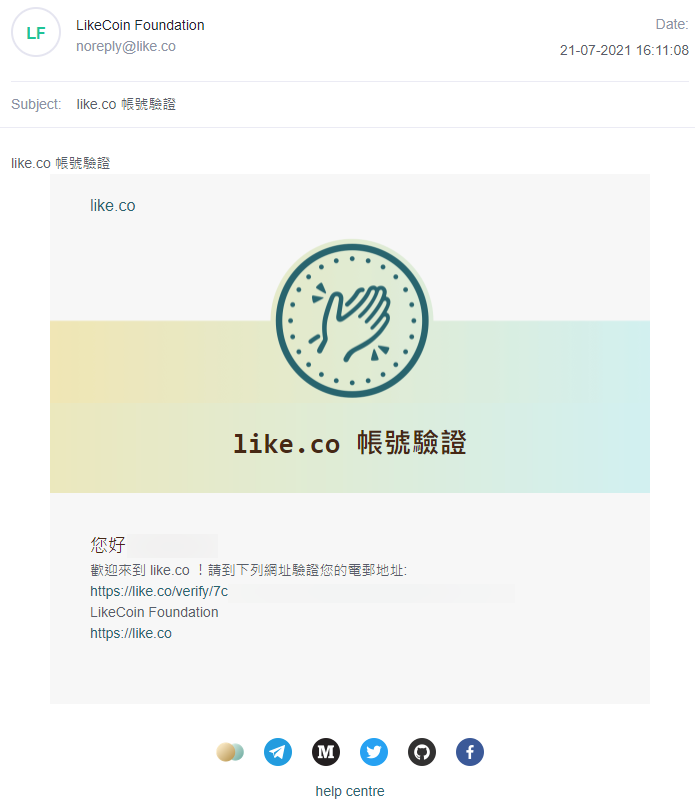

# 以 Keplr 註冊 Liker ID

除了[以電郵、GMail、社交帳號等方式註冊 Liker ID](register.md) 以外，現在用戶可以 Keplr 電子錢包註冊，以更去中心化的方式管理 LikeCoin 並自行掌握私鑰。註冊時無需透露電郵地址等個人資料。用戶只需在註冊/登入畫面選「以錢包登入」即可選擇以 Keplr 登入。

### 步驟一：安裝 Keplr

到 Chrome 線上應用程式商店按「加到 Chrome」安裝 [Keplr extension](https://chrome.google.com/webstore/detail/keplr/dmkamcknogkgcdfhhbddcghachkejeap)。

點擊並將 Keplr 插件「Add extension」加到 Chrome / Brave。

安裝完成後，點擊 Keplr 圖示並顯示註冊畫面。點擊並「Create new account」。

第一行是你的助記詞。請找一個安全的地方加密儲存，因為在回復錢包時會需要用到。

輸入你的 Account name、新密碼、確認密碼然後點擊「Next」，再確認助記詞後系統將顯示 Keplr 錢包介面。


請把助記詞及密碼保存於安全地方，假如你把它們忘記了就沒有辦法管理你的 LikeCoin，而任何人也不能為你重設 Keplr 錢包。


### 步驟二：註冊 Liker ID

在 [Liker Land 網頁版](https://liker.land/)選「註冊」。

點擊右上角「以錢包登入」。

點擊「以 Keplr 註冊」。

點擊「接受」。

此時將彈出 Keplr 視窗，選「Approve」。

填寫你心儀的 Liker ID 並點擊確認。

Liker ID 將成功註冊並轉回 Liker Land 網頁版。

### 步驟三：查看錢包

到 Liker Land 網頁版設定頁面，你會看到你 Liker ID 對應的 LikeCoin 錢包地址
和 Keplr 所顯示的錢包地址相同，亦即代表你已成功使用 Keplr 開立 Liker ID。

### 步驟四：在 Stalk.like.co 使用各種功能

到 [stake.like.co](http://stake.like.co/) 網站，點擊「Keplr Browser Extension」。

再點擊「Approve」

看見這個畫面再「Approve」多一次。

你會看到你的 LikeCoin 餘額。

你可以使用 Keplr 進行各種操作並管理你的 LikeCoin，包括轉帳和委託等。你也可以配合硬件錢包使用  Keplr。


**注意事項**

1. 目前只支援以 Keplr 註冊新 Liker ID，所以現有 Liker ID 無法綁定 Keplr。
2. 同一電郵地址也不能同時以 Keplr 和 Liker Land 註冊 Liker ID。
3. 使用 Keplr 註冊的 Liker ID 並不能登入 Liker Land 手機應用程式及使用其功能，也不能綁定如 Facebook、 Apple ID 等社交帳號。
4. 用戶如需接收 [Liker Land 每月報告](../creatortools/monthly-report.md)，請於設定中輸入電郵地址，並按照指示進行認證方可收到 Liker Land 每月報告及各種最新資訊。


