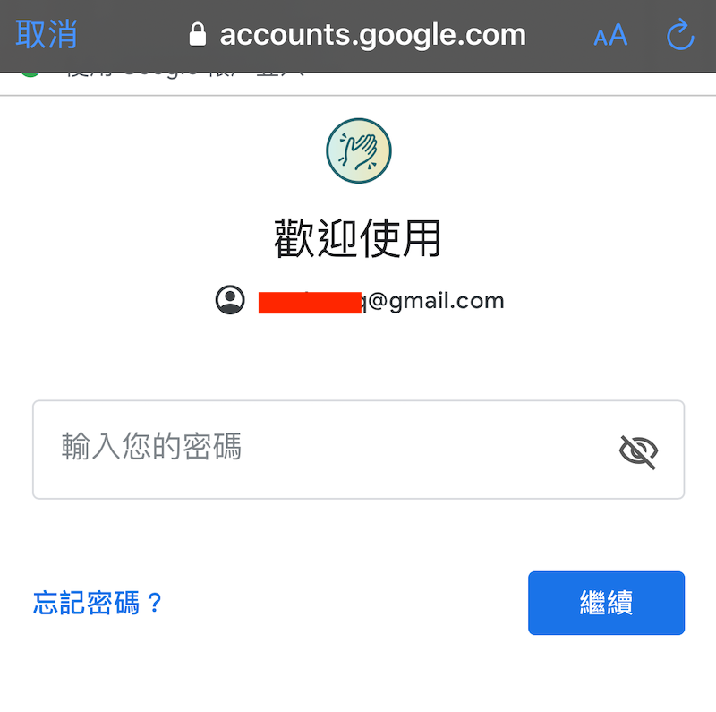
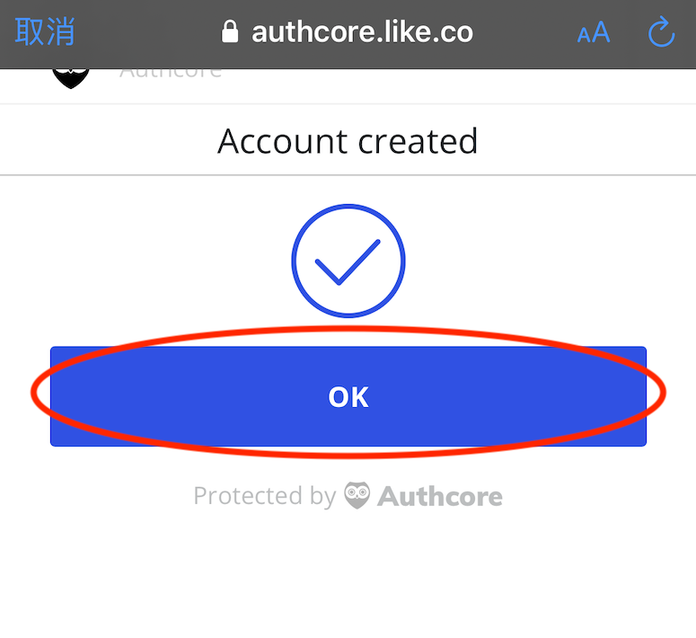

# 註冊 Liker ID

## 註冊 Liker ID

只需下載 [Liker Land 手機應用程式](https://liker.land/getapp)，並執行以下程序即可：

### 步驟一：打開 Liker Land 手機應用程式，點擊「註冊」 / \[Sign Up\] 鍵 

### 步驟二：選擇註冊方式

建議以社交帳號註冊，過程較簡單安全。點擊登入畫面上方的社交帳號圖示，例如以 Google 帳號註冊，請點 Google 圖示；若想以 Matters 帳戶登入，請點擊 Matters 圖示（在圖示欄往右撥會出現 Matters 圖示）

### 步驟三：輸入帳戶資料

填上社交帳戶資料。例如 Google 帳號，請填上 Gmail 地址及登入密碼

成功登入社交帳號後，會出現以下畫面。請點擊 \[Register\]，代表確認以該社交帳號註冊 Liker ID

點擊 \[Register\] 後，系統會嘗試以你的社交帳號註冊。若過程順利，會彈出以下畫面。點擊 \[OK\] 確認

### 步驟四：創建 Liker ID

最後一步。點擊 \[OK\] 後會彈出一個綠色的畫面如下，請輸入你喜歡的 Liker ID。系統已為你預設選了一個，若不滿意可在此步驟中修改。填上 Liker ID 後，選「確認」 / \[Confirm\] 完成程序。


一旦創建了 Liker ID，便不能修改。若不想再用某個 Liker ID，建議你把它留著不用，再創建一個新的。



甚麼是 Authcore：[請參考此條目](https://docs.like.co/v/zh/user-guide/liker-id/what-is-authcore)


