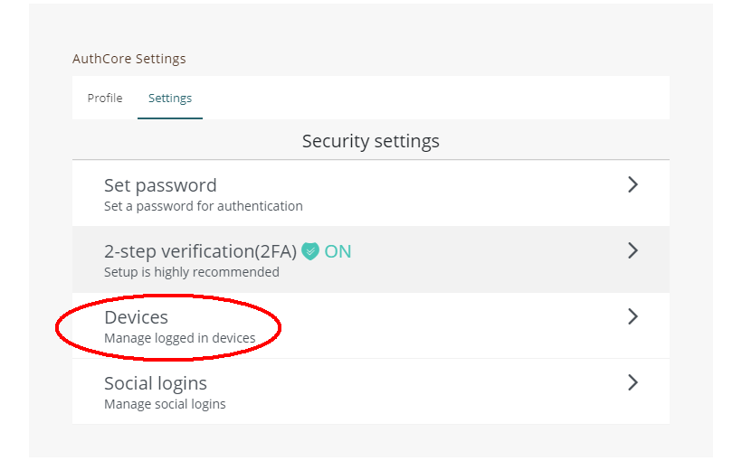
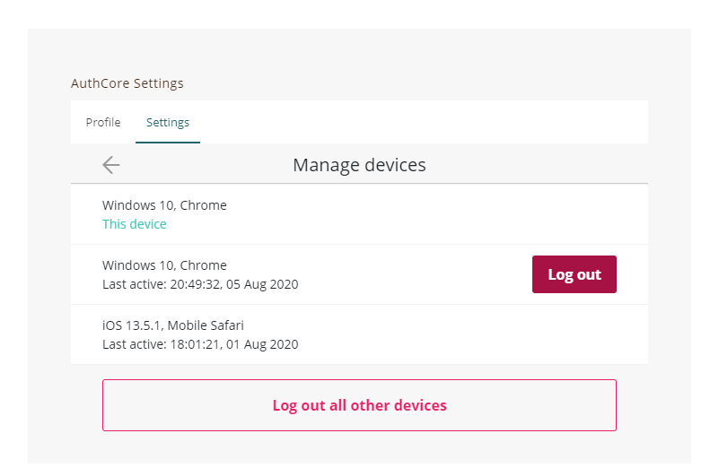
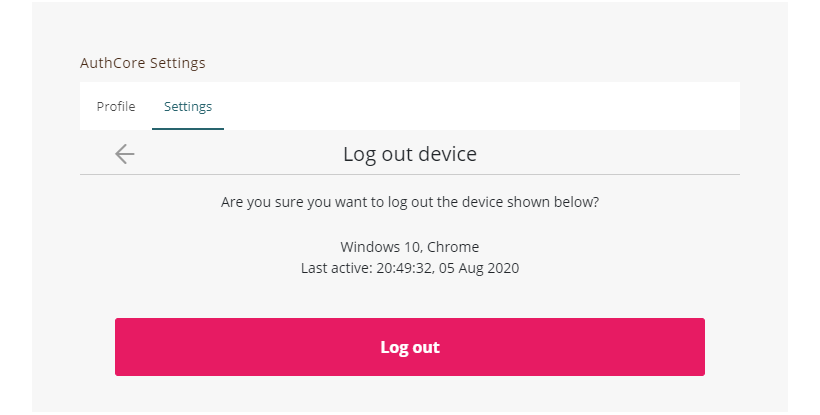

# Manage logged in devices


The followings are for [Liker ID registered through the general method (with Authcore)](./).


You can see computers, phones, and other devices that are currently using or have recently used your Liker ID. You can check this info to make sure no one else has signed in to your account.

#### Mobile

On the [Liker Land app](../../liker-land/download.md), click on setting at the lower right hand corner and select \[Security], then click \[Devices].

#### Web

Go to [https://like.co/in/](https://like.co/in/) and click "Switch to legacy interface" and login.

On "AuthCore Settings", click "Security settings" and "Devices".

"Manage devices" shows all the devices currently logged in your Liker ID, you can click on one of the devices and click "Log Out", or click "Log out all other devices" to log out all devices.


To help keep your Liker ID secure, sign out on devices that:

* Are lost or you no longer own
* Don't belong to you

