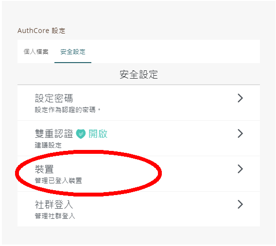
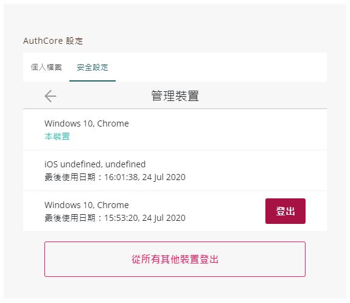
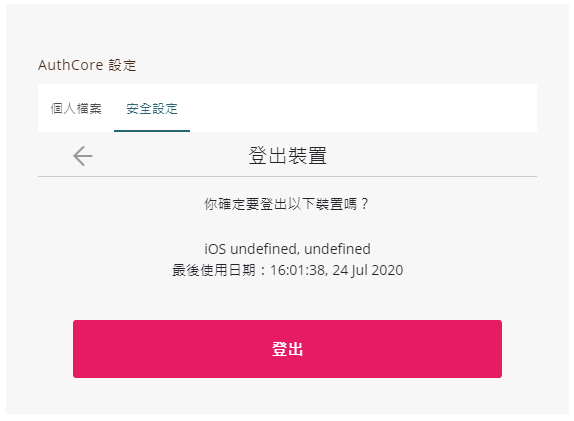

# 管理登入裝置


以下內容只適用於[以一般方法 ( Authcore ) 註冊的 Liker ID](./)。


你可以查看有哪些電腦、手機或其他裝置目前正在使用或最近曾經使用您的 Liker ID。這項資訊可協助你確認沒有其他人登入你的帳戶。

#### 手機版

於 Liker Land 手機應用程式選畫面右下角菜單點擊「安全」，再點 「裝置」。

#### 網頁版

到 [https://like.co/in/](https://like.co/in/) 點「切換舊介面」或「Switch to legacy interface」登入。

打開「Authcore 設定」，點選「安全設定」及「裝置」。

「管理裝置」顯示您目前已登入 Liker ID 的裝置，你可點選某一裝置直接「登出」，也可點擊「從所有其他裝置登出」直接登出所有裝置。


為確保 Liker ID 安全，如果裝置符合下列任一情況，請登出帳戶：

* 您不再具備擁有權或遺失的裝置
* 不屬於您的裝置

