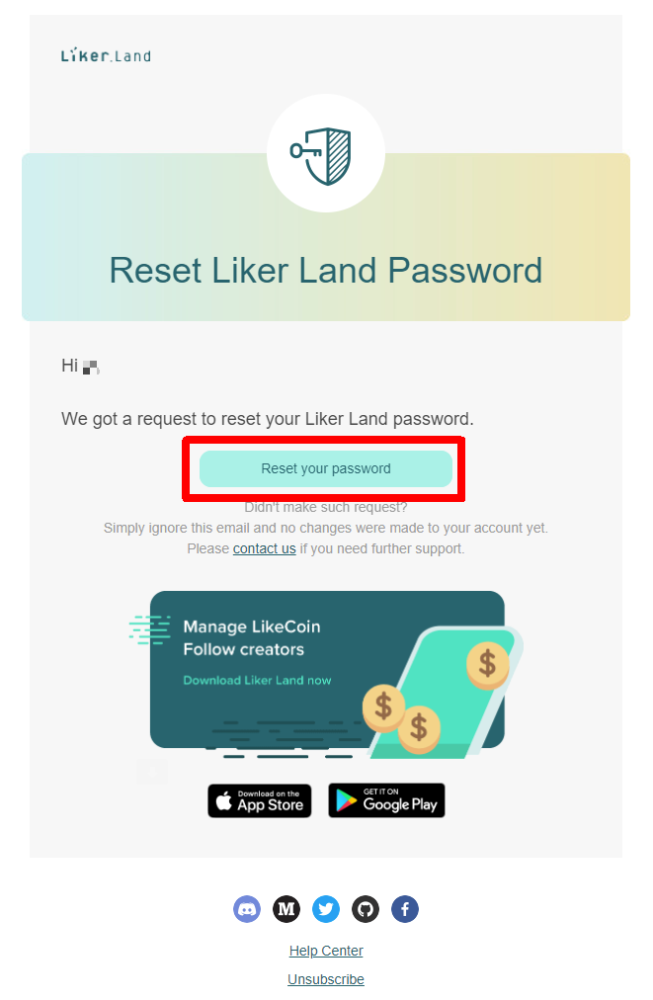

# 重設密碼


以下內容只適用於[以一般方法 ( Authcore ) 註冊的 Liker ID](./)。


有時因為不明原因無法以社交帳號登入 Liker ID，不妨試試以下步驟，重新設定密碼看看。

### **步驟一**

**手機版**

點「登入」。

**網頁版**

訪問 [https://like.co/in](https://like.co/in)。先確保自己在登出狀態，你可以打開右上角的功能選單找到「登出」的選項。

點「切換舊介豐」或「Switch to legacy interface」。

<figure><figcaption></figcaption></figure>

### **步驟二**

在登入視窗中，選「重設密碼」。\

### 步驟三

輸入你註冊的電郵地址再點擊「發送」，一般是你在 Liker Land 上已驗證的電郵地址


若不成功，例如出現「找不到相關電郵或電話號碼」的錯誤訊息，請試試：

* 你用作註冊社交帳號 ( Facebook, Google, Twitter ) 的電郵地址；
* 若你的電郵地址有「點」( . )，請刪掉這個「點」試試。例如 john.chan@gmail.com ，改作 johnchan@gmail.com 再試。


完成後出現以下訊息。

### **步驟四**

接收重設密碼郵件，點擊郵件中的鏈結重設密碼

輸入新密碼兩次，再點擊 "Reset Password"

重設密碼成功，回到 Liker Land app 或 [https://like.co/in/](https://like.co/in/) 登入 Liker ID。

### **步驟五**

在登入畫面，**以電郵及密碼登入**。留意不是選上方的社交帳號登入喔。

### **步驟六**

登入成功後，請訪問 Settings 或 [https://like.co/in/settings](https://like.co/in/settings) ，到 Authcore 設定 → 安全設定 → 社交媒體登入，[重新設定好你的 Google, Facebook, Twitter 等登入方式](social-media-logins.md)。

假若問題仍是無法解決，請到 [Liker Land](https://liker.land/) 或 [Like.co](https://like.co/) 尋求客服幫助。
