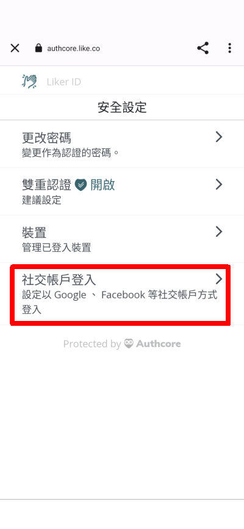
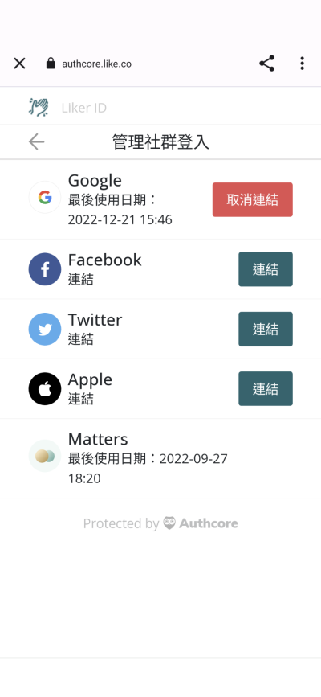
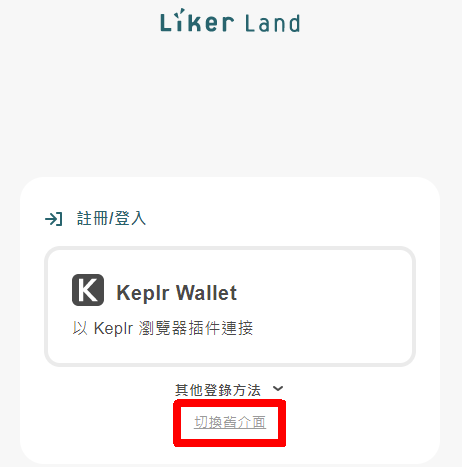
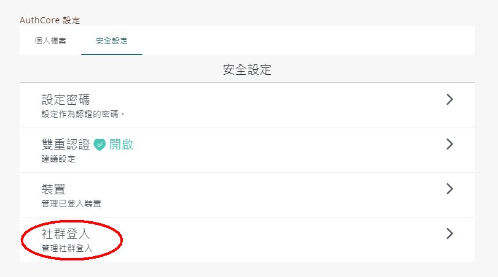

# 綁定社交帳號


以下內容只適用於[以一般方法 ( Authcore ) 註冊的 Liker ID](./)。


## 為什麼要綁定社交帳號

把 Liker ID 綁定社交帳號有兩個好處：

1. 登入時可用你慣用的社交媒體帳號，不用輸入電郵地址及密碼。
2. 保障你的 Liker ID。當一個登入方法出問題時，例如忘了密碼，或出現個別的平台帳號問題，仍可以用其他帳號的身份登入。

## 綁定方法（除 Matters 外）

### 步驟一

#### 手機版

於 [Liker Land 手機應用程式](../../liker-land/download.md)選畫面右下角設定點選「安全」，再點選「社交帳戶登入」。

<figure><figcaption></figcaption></figure>

點擊欲綁定的社交媒體帳號（除 Matters 外），然後按照屏幕指示登入該平台的帳號。

<figure><figcaption></figcaption></figure>

#### 網頁版

到 [https://like.co/in/](https://like.co/in/) 點「切換舊介面」或「Switch to legacy interface」登入。

<figure><figcaption></figcaption></figure>

<figure><figcaption></figcaption></figure>

打開「Authcore 設定」

<figure><figcaption></figcaption></figure>

點選「安全設定」及「社群登入」。

### 步驟二

點擊欲綁定的社交媒體帳號（除 Matters 外），然後按照屏幕指示登入該平台的帳號。

 (2).png>)

## 如何綁定 Matters 帳號 

用戶需要在 Matters 網站內設置綁定：

1. 請登入 [Matters.news](https://matters.news)
2. 點擊左手邊「我的」，從菜單中選「設定」
3. 在「錢包設定」部份，選 Liker ID
4. 按畫面指示登入並綁定 Liker ID

### 更多詳盡介紹


[matters.md](../../creator/matters.md)


> [玩轉 Matters 實用指南](https://matters.news/guide)


一旦綁定 Matters ID 跟 Liker ID，便無法解綁。敬請留意。

