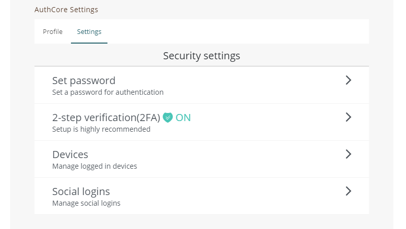
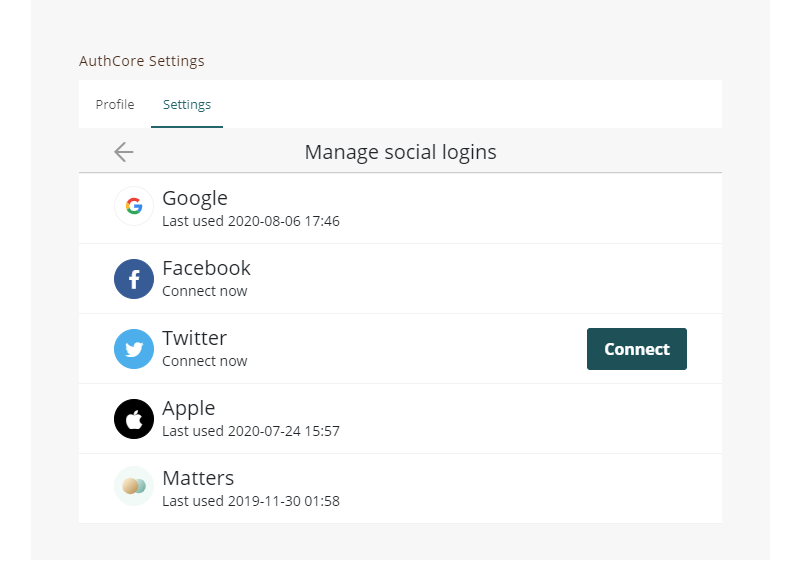

# Connecting to my social profile


The followings are for [Liker ID registered by general method (with Authcore)](./).


## Why linking different social media logins:

There are two benefits linking your social media logins:

1. You don't have to input email address and password, just use your usual social media account to login.
2. Protect access to your Liker ID, if there is an issue with one of the login methods, e.g. forget password, or the platform itself has technical problems, you can still use other social media logins to access your Liker ID.

## Linking Method (Except Matters)

### Step 1

Login [Liker Land](https://liker.land/) and go to Settings or [https://like.co/in/settings](https://like.co/in/settings), go to "AuthCore Settings", click "Security settings", or open the Liker Land mobile app, click on setting at the lower right hand corner and select \[Security], then click \[Social Account login].

### Step 2

Click on the social media login (except Matters), follow on screen instruction and login your account.

## **How to link Matters account**

User has to go to Matters website for linkinging:

1. Switch to English interface on the right hand corner
2. Login [Matters.news](https://matters.news/)
3. Click on "My Page" on the left hand side, select "setting" from the menu
4. On "Wallet setting" , select "Liker ID"
5. Login your Liker ID and link with Matters according to the instructions


Once you link your Liker ID with Matters ID, they cannot be unbonded.

