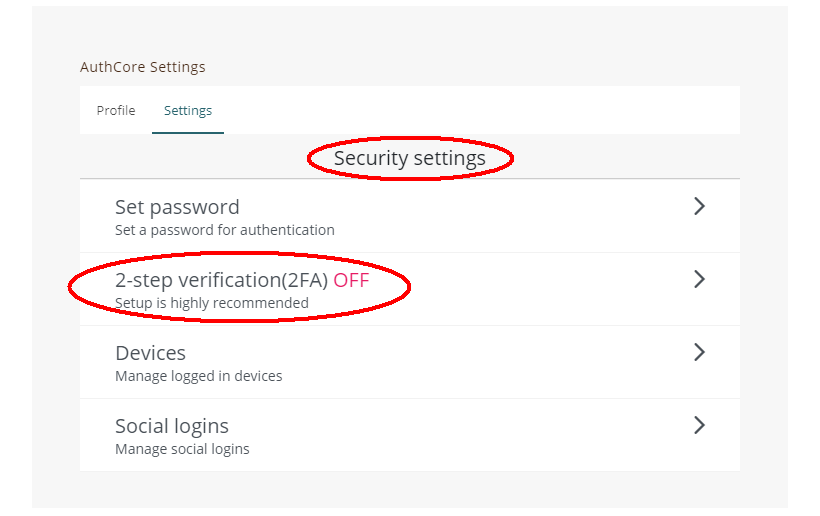
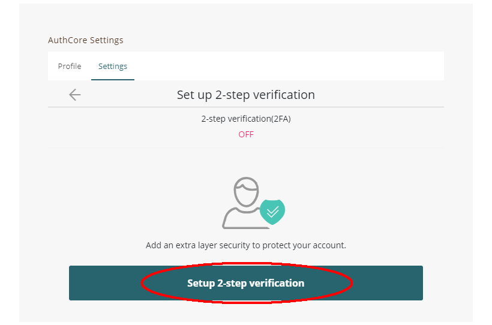
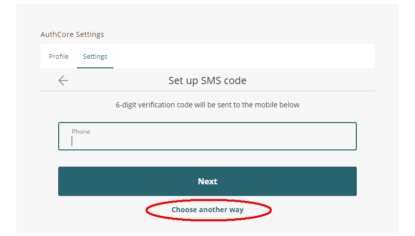
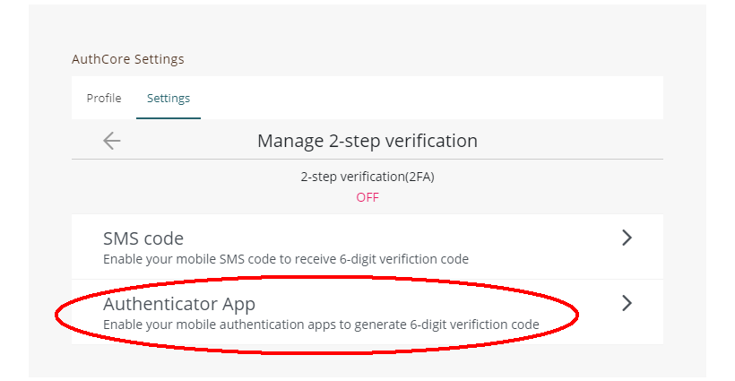
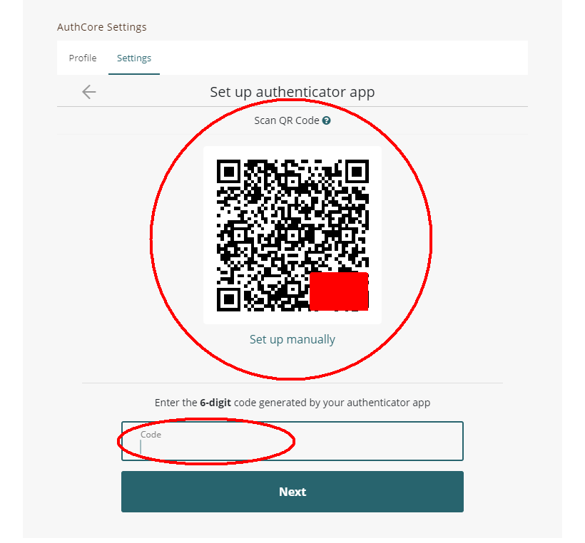
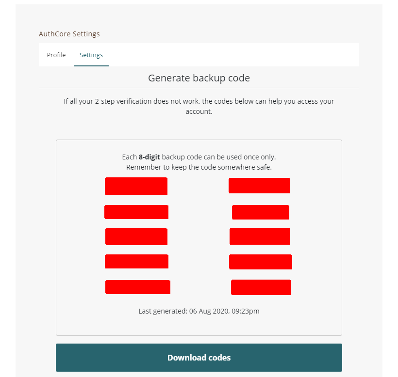

# Securing my Liker ID


The followings are for [Liker ID registered through the general method (with Authcore)](./).


## 2-Step Verification (2FA) 

After setting up 2FA, a 6-digit passcode is required to log in from a new device.

The following steps need to be performed on a desktop computer, and a smartphone is required:

### Step 1: Login with the legacy interface

Go to [https://like.co/in/](https://like.co/in/) and click "Switch to legacy interface" and log in.

<figure><figcaption>
Click "Switch to legacy interface"
</figcaption></figure>

<figure><figcaption>
Log in your account
</figcaption></figure>

### Step 2: Go to security settings

Click "AuthCore Settings".

<figure><figcaption>
Click "AuthCore Settings"
</figcaption></figure>

Select "Security settings" and Click "2-step verification (2FA)".

### Step 3: Select Authentication App

1. Click on "Set up 2-step verification (2FA)".
2. Let's talk about setting up Google Authenticator first. Click on "Choose another way".

Then choose "Authenticator App" on the next page.

### Step 4: Set up Google Authenticator

Continuing from the previous step, the page now displays a QR Code:

1.  Download Google Authenticator on your mobile phone.

    [Google Play Download](https://play.google.com/store/apps/details?id=com.google.android.apps.authenticator2\&hl=zh\_TW)\
    [App Store Download](https://apps.apple.com/hk/app/google-authenticator/id388497605)
2. Open the Google Authenticator app and click on the "+" sign in the top right-hand corner.
3. Scan the QR Code on your desktop computer.
4. An entry for Authcore will be added to Google Authenticator, displaying a 6-digit code. Fill it into the blank space circled in red and click "Next". It will display "Set up authenticator app" and "Complete", then click "OK".
5. Set up your backup code. If all of your 2-step verification tools do not work, the codes below can help you access your account.

2-Step Verification setup is completed.

## Confirm your email address 

### Step 1: Go to Profile setting

Go to [https://like.co/in/](https://like.co/in/) and click "Switch to legacy interface" and log in.

Click on "AuthCore Settings" and select "Profile". Click "Contact" and then click "Email" to go to the "Manage email" page.

### Step 2: Confirm Email

On the "Manage email" page, click "Confirm Now".

### Step 3: Enter the confirmation code

An email with a 6-digit code will be sent to your mailbox. Enter it into the blank space below and click "Confirm".

If you see the page below, it's done.

