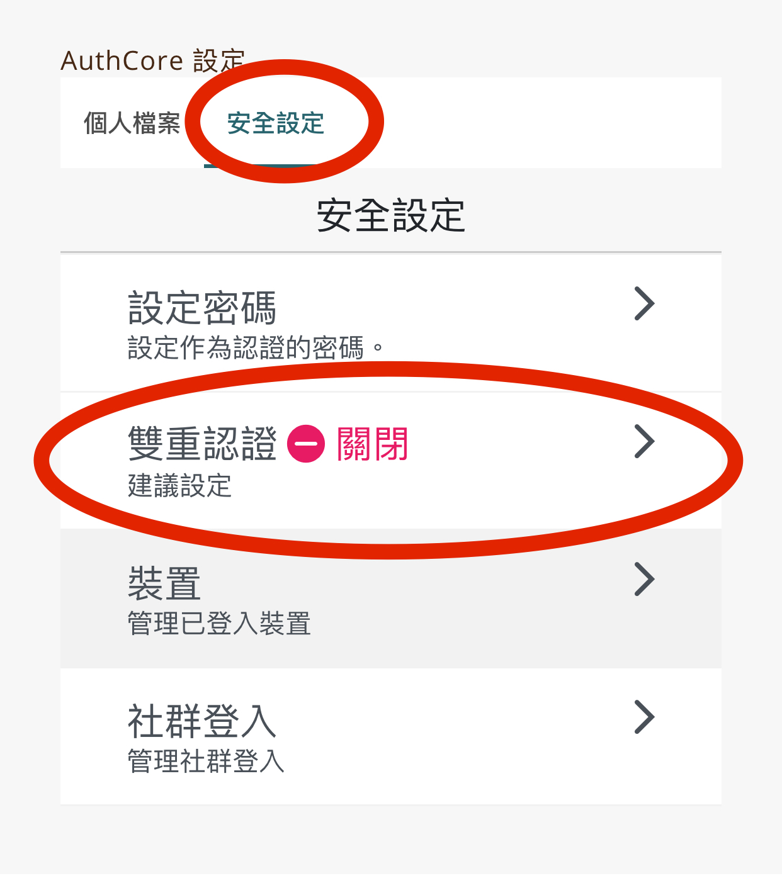
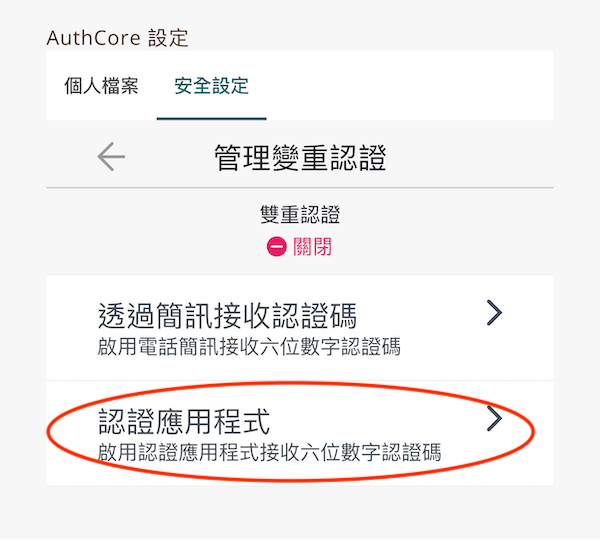

# 保護你的 Liker ID

## 雙重認證 \( 2FA \)

設定雙重認證後，新裝置登入時會要求填上認證碼產生器生成的 6 位數字認證碼。

以下步驟須在桌面電腦上操作，也需要備妥一部你常用的手機。設定步驟如下：

#### 步驟一

1. 登入 [like.co](http://like.co) ，並前往 [https://like.co/in/settings](https://like.co/in/settings)
2. 在頁面中部的「Authcore 設定」中選擇「安全設定」分頁
3. 點擊「雙重認證」

#### 步驟二

1. 點擊「設立雙重認證」鍵
2. 這裡先介紹以 Google Authenticator 設定的流程。請在畫面下方選「使用其他方式」

在下一個頁面，選擇「認證應用程式」。

#### 步驟三：設定 Google Authenticator

上一步後，屏幕上顯示的裡面是：

1. 在手機上下載 Google Authenticator 應用程式 [安卓版下載鏈結](https://play.google.com/store/apps/details?id=com.google.android.apps.authenticator2&hl=zh_TW) [蘋果版下載鏈結](https://apps.apple.com/hk/app/google-authenticator/id388497605)
2. 打開 Google Authenticator 應用程式。點擊應用程式右上角的 「＋」
3. 掃描桌面電腦上的二維碼
4. Google Authenticator 畫面的底部會新增了一個 Authcore 的列，並顯示一組六位的數字。把該組數字填寫在桌面電腦畫面的底部紅圈位置

所有設定雙重認證的步驟至此完成了。

## 認證電郵地址

1. 訪問 [https://like.co/in/settings](https://like.co/in/settings,) ，在「AuthCore 設定」下點選「個人檔案」，再點選「電郵」，跳入「管理電郵」的頁面
2. 在「管理電郵」的頁面，點「現在認證」

3. 你的郵箱會收到一封包含六位數字認證碼的電郵。請填在下方畫面的空格中，點「認證」

4. 見到下方這畫面，代表認證已成功

