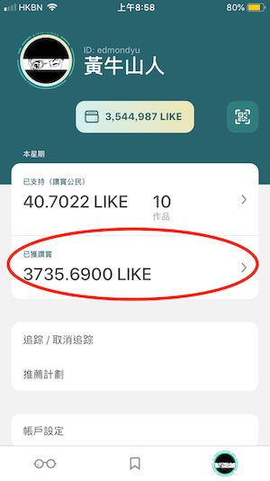
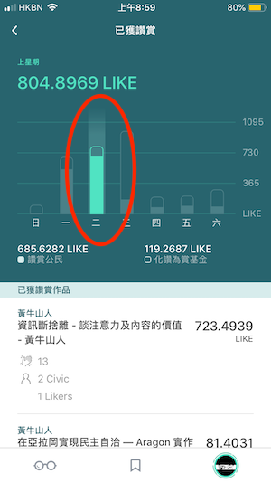

# 查看讚賞成就

點擊 Liker Land 手機應用程式右下角的個人頭像，能查看你本星期因讀者讚賞而獲的 LikeCoin。

點擊上圖紅圈位置進入詳細統計頁面，上方顯示的是本週收入棒形圖，然後是本週累積的按讚數字，分別來自多少位讚賞公民及免費 Liker 等資料。再往下撥，則是每篇文章獲得讚賞的明細。

你可以左右滑動上方的棒形圖介面，翻查過去的統計數據。

 點擊棒形圖中的某一天，還可查看該天的讚賞收益明細。

