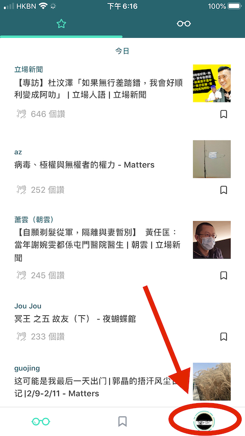
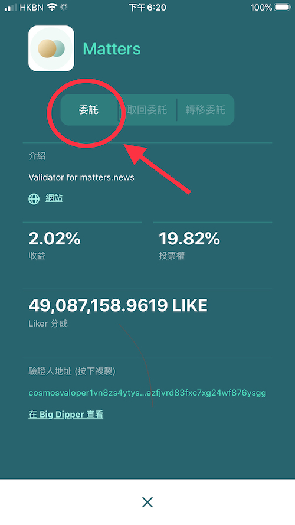
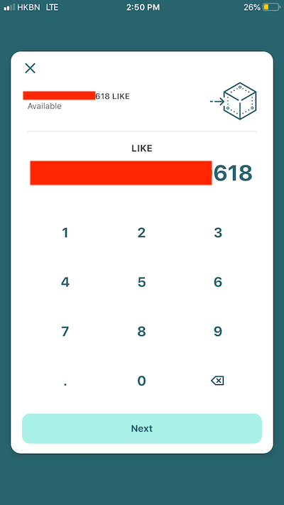

# Delegation of LikeCoin

Delegation means delegating LikeCoin to one or more [validators](https://docs.like.co/constitution#9d28), letting them to represent you to raise proposals and vote for or against the proposals, and most importantly to earn rewards. Delegation demonstrates [liquid democracy](https://docs.like.co/user-guide/likecoin-chain/liquid-democracy) and is vital to the autonomy for The Republic of Liker Land.

### Step 1: Select a validator

Open the Liker Land mobile app, click on the avatar at the lower right hand corner, then click the amount of LikeCoin to enter into the wallet page. In this page you can check the LikeCoin amount that you have, there is a list of validators underneath. To start with, there are seven organizations/corporations/groups as validators for The Republic of Liker Land. You can select one of them as you like.

Select one of the validators and bring up the page below, list out percentage of Rewards, Voting Power and how much LikeCoin was delegated to this validator \(Liker Share\).

Click \[Delegate\] and go to the next page.  

### **Step 2: Input the amount of LikeCoin to delegate**

Click \[Delegate\] will bring up the following page, input the number of LikeCoin that you would like to delegate to the validator, then click \[Next\]  

跳至確認畫面，顯示出驗證人的委托戶口地址，按 \[Details\] 還可以核查委托款項及有沒有收取交易費用（目前所有委托動作均沒有費用）。

點擊「確應」 / \[Confirm\]，稍待幾秒，畫面上方會出現 "Transaction Completed" 字樣，代表已完成委托。

### 步驟三：躺著賺回報吧！

回到錢包的頁面，你可以下拉刷新錢包的狀態。

回饋金額會 5 至 6 秒派發一次 - 什麼？跟銀行的每月派息快太多了吧！你可在錢包的 「未領取收益」 / \[Rewards\] \[Delegating Rewards\] 欄查看累積的回饋金額，或按「領取收益」 / \[Withdraw Rewards\] 把回報存進錢包，留意最低l收益存進數量為 1 LikeCoin，少於 1 LikeCoin 的收益將不能存進錢包。  
已委托的驗證人，會在下方列表中顯示為綠色。

### 了解更多有關「委托」的原理

委托的功能，是讚賞公民共和國「流動民主」機制的重要一環。想知道更多有關概念，請閱讀以下文章：

> [身為一個鏈上公民，感受質押世界的魅力！- 以 LikeCoin 為例](https://matters.news/@dablog/%E8%BA%AB%E7%82%BA%E4%B8%80%E5%80%8B%E9%8F%88%E4%B8%8A%E5%85%AC%E6%B0%91-%E6%84%9F%E5%8F%97%E8%B3%AA%E6%8A%BC%E4%B8%96%E7%95%8C%E7%9A%84%E9%AD%85%E5%8A%9B-%E4%BB%A5-like-coin-%E7%82%BA%E4%BE%8B-zdpuB1ePtb7TNzYpbfkdhNmf8REKkQxNX5MgRRir1BG6pWVts)

> [LikeCoin 新手的委託質押筆記](https://matters.news/@huanlin/like-coin-%E6%96%B0%E6%89%8B%E7%9A%84%E5%A7%94%E8%A8%97%E8%B3%AA%E6%8A%BC%E7%AD%86%E8%A8%98-bafyreifhicuom74neq4sojpkta6thdsia3y4zf7dmolgajvgph4c3usx5u)

