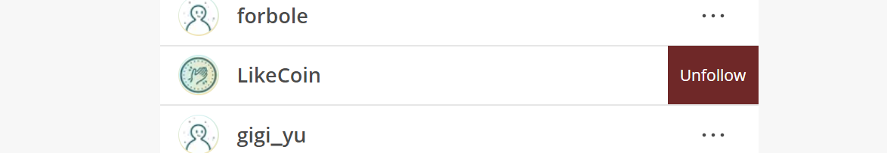

# Download Liker Land

* Download Liker Land on [Google Play](https://play.google.com/store/apps/details?id=com.oice) or [App Store](https://apps.apple.com/hk/app/liker-land/id1248232355)
* For users in China, or Android devices without Google Play, download [APK on GitHub](https://github.com/likecoin/likecoin-app/releases)
* [After downloading Liker Land](https://liker.land/getapp), please register a Liker ID：


[liker-id](../liker-id/)


## Liker Land web - https://Liker.Land 

Although Liker Land mobile app provides the functions that best suit your needs, [Liker Land web](https://liker.land/) also brings the same convenience for [discovering, following](../../archive/archive/liker-land/today-headline.md) and [bookmarking content to Readling List](readling-list.md).

Click on the menu at the top right hand corner, there are other options.

### **Option 1: Civic Liker**

You can delegate your LikeCoin to become a [Civic Liker](../civic-liker/) and check your current status by the dashboard.

### **Option 2: I'm a Creator too**

* Click and setup your [Creator Pitch](../creatortools/creators-pitch.md).
* Click "[Tips for Creators](https://liker.land/creators)" and goes to the "You deserve to be rewarded" page to learn more about ways to [embed a LikeCoin button to a website](https://liker.land/creators/setup).


[like.md](like.md)



[creator](../creator/)


### **Option 3: Settings**

3 preferences can be set up:

* Language: This is talking about the Liker Land web language preference and is not going to alter your Liker Land mobile app setting (You may refer to the mobile app setup)
* Liker ID: Redirect to [Like.co setting page](https://like.co/in/settings). User can set up his/her Liker ID avatar, social media logins, etc. Read this for more details:


[edit-avatar-displayname.md](../liker-id/edit-avatar-displayname.md)


* Follow / Unfollowed: Display [Content Jockey](superlike.md) that the user followed, can click to unfollow (refer to the below)

### **Option 4: App**

Link to [download Liker Land app](https://liker.land/getapp).

### **Option 5: About**

Liker Land introduction.

### **Option 6: Support**

Contact LikeCoin help desk.

### **Option 7: Logout**

Click and logout Liker Land. If you want to login with another Liker ID, you have to log out completely from the Liker Land web, otherwise you will be bounced back to the previous Liker ID during your next login attempt.
