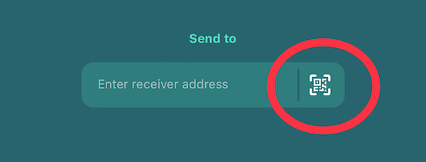

# LIKE pay

### Step 1

Download [Liker Land mobile app](https://like.co/in/getapp), we do not support transferring LikeCoin on desktop computers at the moment.

### Step 2

Open the mobile app, click on the avator at the lower right hand corner, then click on the LikeCoin amount that you have on top. You can manage your wallet now. Then, Click the \[Send\] button.

### Step 3

You can fill in the Liker ID or wallet address into the \[Enter receiver address\] field, or else scanning QR Code: Ask the LikeCoin receiver to open his/her wallet and click \[Receive\] button to show his/her QR Code. Then you can click on the icon circled in red, using your phone camera to scan the LikeCoin receiver's QR Code. 

### **Step 4**

Liker Land mobile app will open your phone camera, scan the Likecoin receiver's QR Code, and click the \[Next\] button.

### **Step 5**

Input the LikeCoin amount that you have to transfer, click \[Next\] and then click \[Confirm\].

