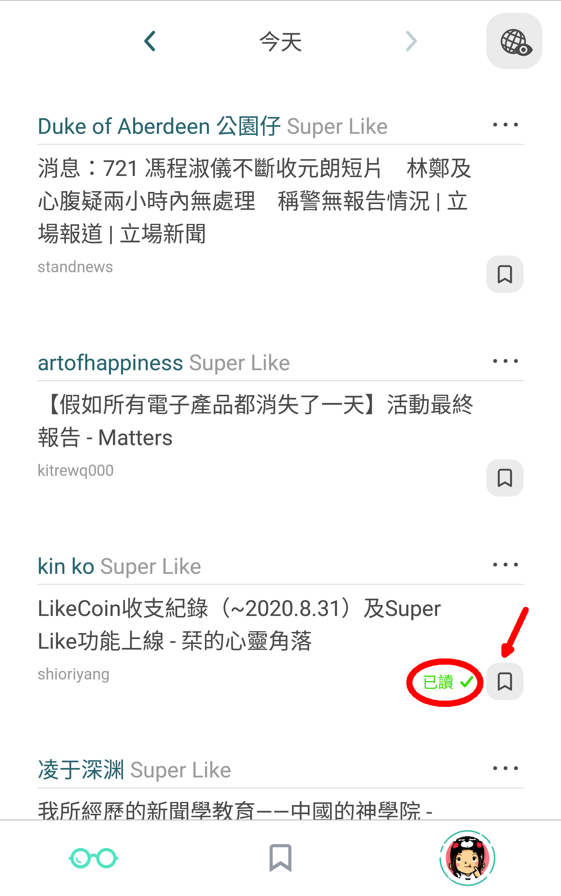

# 優質內容 — Super Like

時間有限，每天面對巨量資訊，總有透不過氣的感覺。作為讀者最希望由專家提供精選內容，節省寶貴時間之餘更可擴闊眼界。Like Land 的 Super Like 機制正正提供了內容精闢的閱讀渠道：

### 你的 Super Like 日報頭條

打開 Liker Land 手機應用程式，即可看到每位「內容伯樂」\( Content Jockey \) 每天 Super Like 推薦的好文章。所有你曾讚好過的內容作者都可以是你的內容伯樂，由他們 Super Like 的文章都會在 Super Like 日報頭條中出現。

每位內容伯樂每天只可推薦兩篇文章，以確保他們提供的均屬精選。

假如你經已閱讀過該篇文章，系統會顯示為「已讀」（紅圈），你亦可以點擊書籤（紅箭嘴）「收藏」文章以供日後翻閱。

若你想停止追縱某位內容伯樂，可到 Liker Land 手機應用程式，選畫面右下角的帳戶頭像，再點 \[設定 Content Jockey\] 進行設定。你亦可以到 Liker Land 網頁版中設定停止追縱。

### 暢遊 Super Like 宇宙

覺得你的 Super Like 日報頭條不夠看？不打緊！點擊右上角的 \[地球\] 鍵，即可暢讀所有內容伯樂的 Super Like 精選文章，發堀更多精彩內容。假如你覺得他/她的品味不錯，更可點擊 \[追蹤\]，以後他/她經手 Super Like 的文章就會在你的 Super Like 日報頭條版面出現。同樣你亦可點擊書籤「收藏」文章。

### 成為內容伯樂投入 Super Like 生態

你也有想推薦的好文章嗎？成為內容伯樂不單止回報作者並將好作品與眾同享，更能因此而獲得回饋。
成為[讚賞公民](https://docs.like.co/v/zh/user-guide/civic-liker)便可立即榮升為內容伯樂，每天獲得兩次免費 Super Like 機會，分享值得曝光的好文章。



