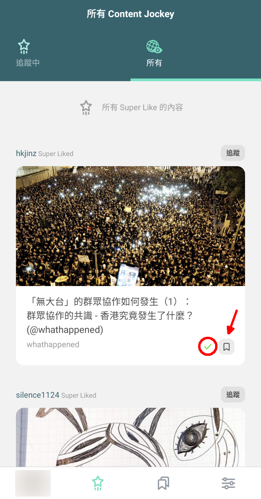
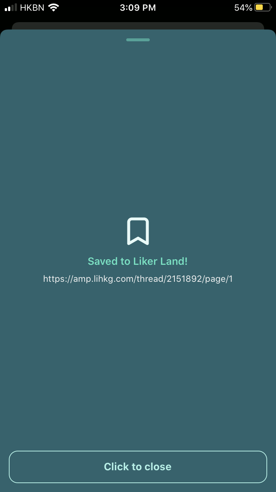
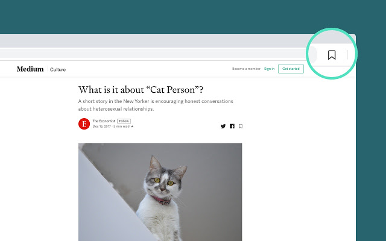
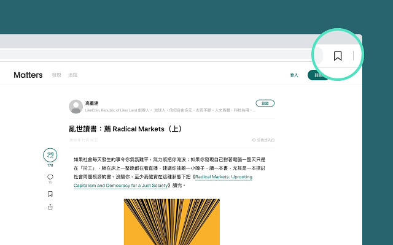
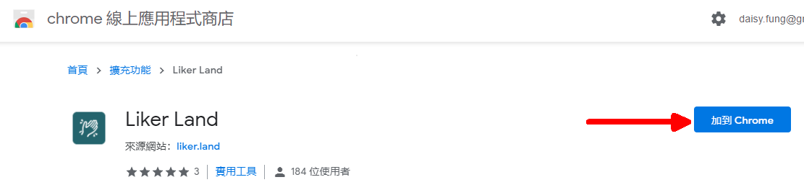

# 閱讀列表

好文章留待空閒時深度閱讀，Liker Land 帶給你貼心的便利。無論使用桌面電腦、手機、平板電腦或 Liker Land 手機應用程式，都可以閱讀並隨意加上書籤收藏任何網頁，動人文章隨時回看。

## 以 LikeCoin button 收藏文章 

在文章看到讚賞鍵可以點擊書籤「收藏」

文章被收藏後讚賞鍵將顯示「已收藏」

## 在 Liker Land 手機應用程式收藏文章


假如你在「你的 Content Jockey Super Like 的內容」或「所有 Super Like 的內容」經已閱讀過一篇文章，系統會顯示為綠剔已讀（紅圈），你亦可以點擊書籤（紅箭嘴）收藏文章到閱讀列表以供日後翻閱。

## 在手機與平板收藏文章到 Liker land 

步驟一：在瀏覽器或應用程式（例如 Twitter）閱讀文章時，點擊 \[分享] 鍵

步驟二：點擊手機中的 Liker Land 手機應用程式圖示

步驟三：出現以下畫面，即代表內容經已成功收藏至 Liker Land

## 在電腦收藏文章到 Liker Land 

Liker Land Chrome / Brave / Firefox 插件讓你為網頁加上書籤儲存，留待有空時細閱。

步驟一：到 Chrome / Firefox 線上應用程式商店把 Liker Land 插件「加到 Chrome/Firefox」。

[Chrome / Brave 版](https://chrome.google.com/webstore/detail/liker-land/cjjcemdmkddjbofomfgjedpiifpgkjhe)

[Firefox 版](https://addons.mozilla.org/en-US/firefox/addon/liker-land/?src=search)

步驟二：在瀏覽器閱讀文章時，點擊圖示收藏文章。

## 查看閱讀列表

點擊 Liker Land 手機應用程式或 [Liker Land 網頁版](https://liker.land/bookmarks)點擊「書籤」圖示可查看已收藏文章。

