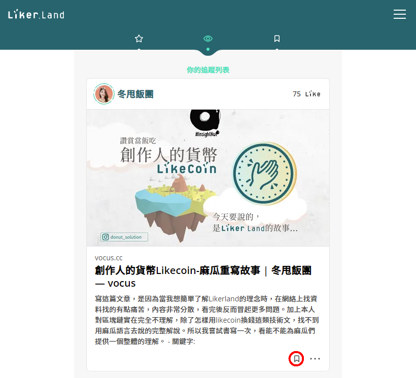
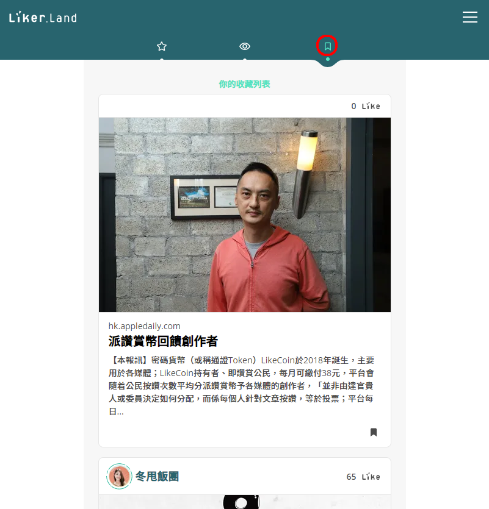
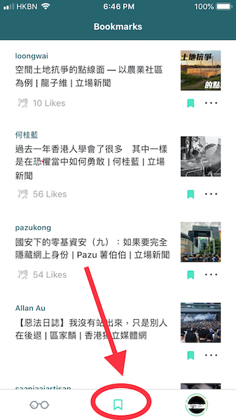

# 收藏心愛內容稍後閱讀

全方位追蹤好內容留待空閒時閱讀，Liker Land 帶給你貼心的便利。無論使用桌面電腦、手機、平板電腦或 Liker Land 手機應用程式，你都可以隨意加上書籤收藏任何網頁，動人文章隨時回看。

### 使用讚賞鍵收藏網頁

在任何文章看到讚賞鍵都可以點擊書籤「收藏」

文章被收藏後讚賞鍵讚示「已收藏」

### 使用 Chrome/Firefox 插件收藏網頁

使用 Liker Land Chrome/Firefox 插件為網頁加上書籤儲存，留待有空時細閱，詳見：



### 在 Liker Land 手機應用程式或 Liker Land 網站收藏網頁

在 [Liker Land 手機應用程式](https://docs.like.co/v/zh/user-guide/liker-land/discovering-contents)點擊「書籤」（紅圈）收藏文章

在任何瀏覽器登入 [Liker Land 網頁版](https://liker.land/)， 點擊「書籤」（紅圈）收藏文章

### 查看已收藏內容

在 [Liker Land 手機應用程式](https://docs.like.co/v/zh/user-guide/liker-land/discovering-contents)或 [Liker Land 網頁版](https://docs.like.co/v/zh/user-guide/liker-land/liker-land-web)的「書籤頁」（紅圈），隨時查看已收藏的內容。

