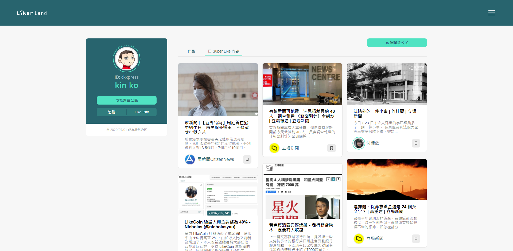

# Super Like - 推文到宇宙

## 概念

點擊讚賞鍵第六下，將自動分享文章到去中心社交媒體 [depub.space](../../guides/decentralized-publishing/depub.space.md)，提升高質內容的曝光度，推文永存於區塊鏈。

[Liker Land app](https://liker.land/getapp) 將顯示 depub.space 的 World Feed。

推文上鏈所需的 gas fee 及分散式儲存費用將由 Liker Land 補貼。

_(\*舊有的 4 LikeCoin 奬勵將會取消。)_

### **協力發展 Web3 內容宇宙**

depub.space 是 LikeCoin 生態內的去中心社交媒體，每則推文都是一筆鏈上記錄，只需 [Keplr](../../guides/wallet/keplr.md) 錢包登入或使用 Liker Land app 進行 Wallet Connect 即可使用，無需註冊，預設私隱。

作者需要內容策展的工具和傳播的渠道。傳統推廣好文章的方法之一是把連結複製到社交媒體如 Facebook 或 Twitter，現在 Liker Land 帶來一個嶄新的選擇：讀者在支援 [LikeCoin button](../creator/) 的網站，一鍵把內容發佈到 depub.space，讓任何網站內容都可輕鬆地在元宇宙曝光。

### depub.space 的手機版？

目前使用 depub.space 必須透過桌面電腦的 [Keplr](../../guides/wallet/keplr.md) 瀏覽器插件，暫無手機方案。Liker Land app 是 LikeCoin 的手機版錢包，在跟 depub.space 整合後，或有可能進一步發展出手機上推文的功能。要實現這一步尚有不少待解決的難題，社群的開發者們正為此在 [Discord](http://discord.gg/likecoin) 討論，歡迎參與。

Super Like 改版尚未完工，目前正於內部測試階段，預計一個月內推出。

## 使用方法

* 在讚賞鍵點 5 次，讚賞鍵的圖案會從拍掌圖案轉變成星形圖案，這時再點第 6 次，便使用了 Super Like。
* 被 Super Like 了的文章會顯示在 Liker Land 及 depub.space 上。你的追蹤者能在「你的追蹤列表」中看到，而所有人也能在「所有 Super Like 的內容」頁面看到。

* 星型圖案中顯示了一個「勾號」，代表 Super Like 的機會已用畢。Super Like 功能逢中午 12 時及凌晨 12 時重置，用完一次需待重置時間後才能再次使用。讚賞鍵的綠色外圈是距離下次重置時間的進度條。
* 右下方的廣播圖示亮著代表這篇文章已被分享到 Liker Land 及 depub.space 上。
* Super Like 的機會次數不會累積，若重置前沒有用掉，重置後也仍然只有一次機會，因此每天最多只能使用 Super Like 兩次。
* 可重複給同一篇文章 Super Like。
* 創作者點擊自己的文章的讚賞鍵可 Super Like 並將作品放置於個人主頁的作品集及「所有 Super Like 的內容」頁面。

## 功能展示



## 怎樣參與

只有[讚賞公民](../civic-liker/)可獲每天兩次的 SuperLike 機會。

【[成為讚賞公民](<../civic-liker/be-a-civic-liker (1).md>)】

## Super Like 履歷

想回顧曾經 Super Like 過哪些好文章？請到[個人主頁](../creatortools/portfolio-page.md) https://liker.land/\[你的 Liker ID] 點擊「已 Super Like 內容」查看，例如你的 Liker ID 是 ckxpress，鏈結便是 https://liker.land/ckxpress。用戶也可以直接輸入網址訪問朋友或名人的個人主頁並追蹤，了解他們的閱讀品味。

