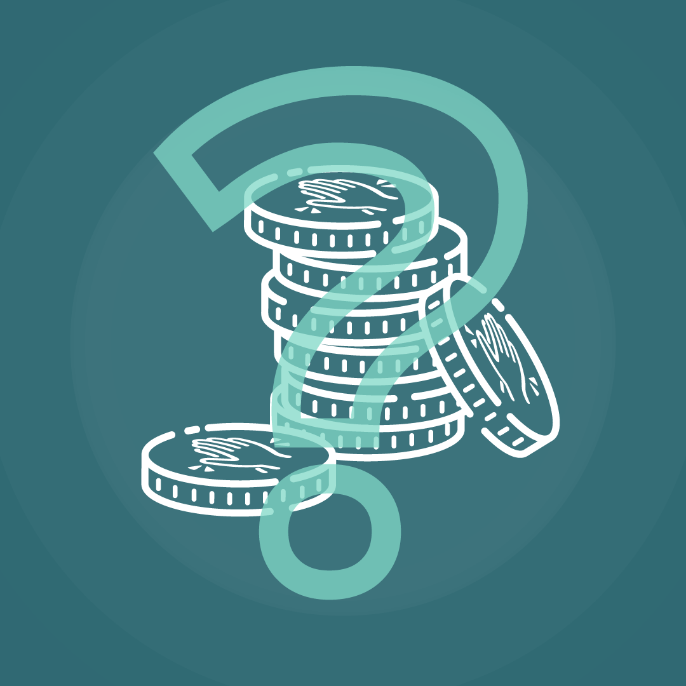

# Where comes the LikeCoin rewards?

_This article reflects the status during December 16, 2019_

Delegation generates rewards as each delegator helps to validate transactions.

Delegate LikeCoin and earn rewards, this article explains where the LikeCoin rewards come from. As all the parameters can be modified according to community's autonomous mechanisms later on, please note the number below reflects the situation of December 2019.  
  
Validator's rewards for recording all transactions is from inflation. currently set up as 1% of the total LikeCoin circulation, which is ten million out of one billion LikeCoin.

The inflation amount will be distributed when a block is created in LikeCoin chain, approximately in every 5-6 seconds

2% of the newly minted LikeCoin from inflation will be treated as "Tax" and reserved for the Community Pool. In other words, 98% of LikeCoin from inflation is for validators and stakeholders. Usage of the Community Pool will be determined accordingly to the community's autonomous mechanisms.

If a block is created on every 6 seconds, the number of new blocks created per year are 365\*24\*60\*10 = 5,256,000, therefore the LikeCoin shared to each validators and stakeholders from each block are:

= 10,000,000 LikeCoin x 98% / 5,256,000

= 1.86 LikeCoin

That means 1.86 LikeCoin is minted every 6 seconds for validators and stakeholders to distribute according to their delegation ratio. Currently the commission rate is 50%, therefore the LikeCoin given to stakeholders every 6 seconds is 1.86/2 = 0.93.

The above calculation based on the assumption of a new block is created every 6 second, but in fact there are deviations in real life. Adding to the 98% from inflation, 98% transaction fee from each transaction will also be distributed to validators and stakeholders according to their delegation ratio.

