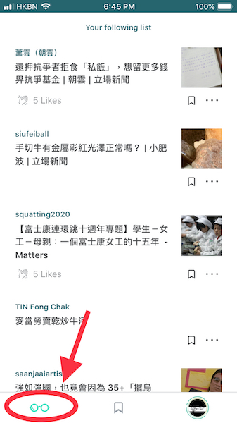

# 瀏覽內容

[Liker Land 手機應用程式](https://docs.like.co/v/zh/user-guide/liker-land/liker-land-mobile-app)提供幾個方法，讓你發現最適合自己的內容。

### 追縱

追縱所有你曾讚好過的內容作者，他們的新作都會在「追縱」頁中出現。

若你想停止追縱某位作者，可到 Liker Land 手機應用程式，選畫面右下角的帳戶頭像，再點 \[Following/Unfollow\] 進行設定。你亦可以到 Liker Land 網頁版中[設定停止追縱](https://docs.like.co/v/zh/user-guide/liker-land/liker-land-web#xuan-xiang-san-she-ding)。

### 書籤

把喜愛的文章鏈結儲存起來，有空時細閱。配合 [LikeCoin Chrome/Firefox 插件](https://docs.like.co/v/zh/user-guide/likecoin-plugin/liker-land-browser-extension)，可讓在任何電腦上，瀏覽**任何網頁**（亦即是不限於已安裝讚賞鍵的網站）時加上書籤，把鏈結儲存起來供日後在 [Liker Land 手機應用程式](https://docs.like.co/v/zh/user-guide/liker-land/liker-land-mobile-app) 或 [Liker Land 網頁版](https://docs.like.co/v/zh/user-guide/liker-land/liker-land-web) 查閱。

此外你亦可以在 Liker Land 手機應用程式點擊畫面右下角的帳戶頭像，再選 \[Website Sign-in\] 預先登入平日常到的網站，瀏覽時就更方便了。

