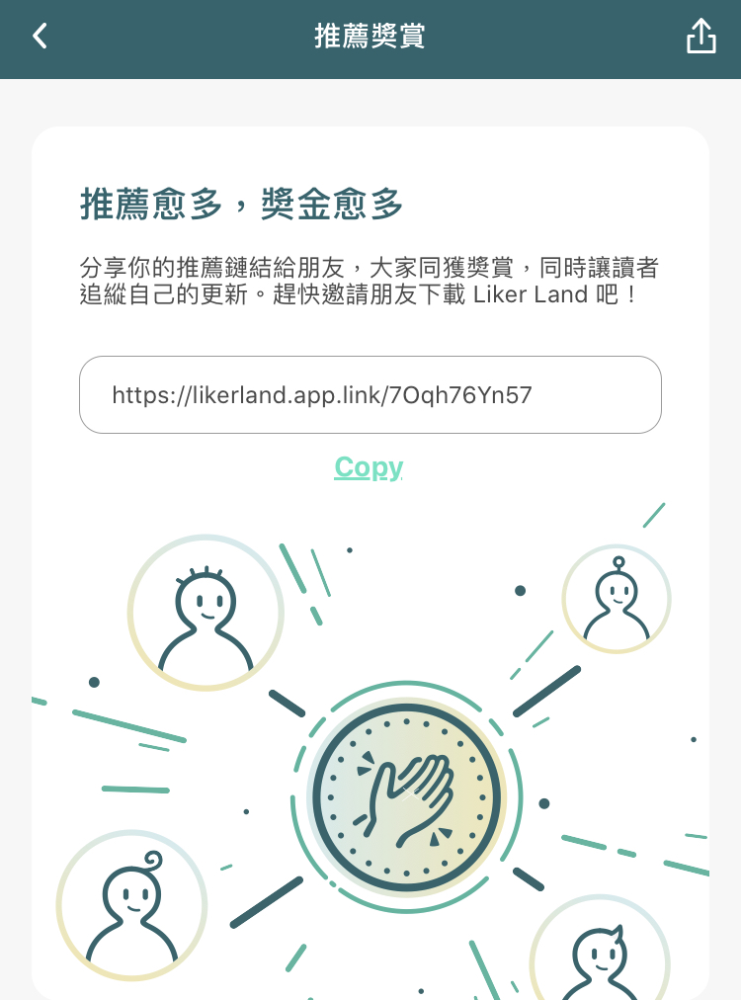

# 推薦下載奬賞

### 推薦朋友下載 Liker Land，有以下好處

* 讀者以鏈結下載 [Liker Land 手機應用程式](https://like.co/in/getapp)，便會預設追蹤了你，每次讀者打開 Liker Land，你的作品會自動顯示在追蹤列表上，Liker Land 彷彿成了你的作品專屬程式 
* 你和你推薦的讀者能各得 100 LikeCoin 奬賞
* 多推薦多賞，沒有上限
* 讀者在 Liker Land 上按讚更加流暢，助你進一步化讚為賞
* 分享你的推薦鏈結，建立讀者群

### 推薦方法

1. 把你的專屬推薦鏈結分享給朋友，請他/她點擊鏈結下載 [Liker Land 手機應用程式](https://like.co/in/getapp)
2. 推薦鏈結的格式： https://likerland.app.link/?event=app\_referral&referrer=\[你的 Liker ID\]。例如若你的 Liker ID 是 ckxpress，鏈結便是 _https://likerland.app.link/?event=app\_referral&referrer=ckxpress_
3. 朋友下載 Liker Land 後，若系統問及推薦人的 Liker ID，便請他填寫你的 Liker ID
4. 請你的朋友到 [https://like.co/in/settings](https://like.co/in/settings/) 完成短訊認證程序，位置在 _Authcore 設定 → 聯絡方式 → 管理聯絡方式 → 電話號碼_
5. 完成短訊認證後，請朋友再次打開 Liker Land 一次即可。奬賞會於幾天內直接發送至 Liker Land 錢包,，亦會收到電郵通知

每位用戶只限被推薦一次，但可無限推薦別人。推薦和被推薦雙方均須完成短訊認證。

### 在 Liker Land 中複製推薦鏈結

你也可在 Liker Land 中點擊自己的頭像進入設定畫面，點擊「推薦奬賞」選項，複製你的推薦鏈結。鏈結格式雖然跟上述的不同，但效果是一樣的。

