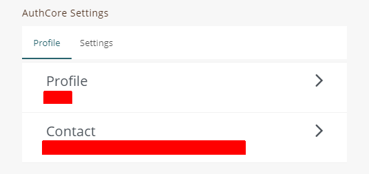

# Referral Bonus

### Advantage of referring your friend to download Liker Land

* When readers download the [Liker Land mobile app](https://like.co/in/getapp) via your referral link, they follow your works too. Every time when the Reader opens Liker Land, your works appear on his/her following list. Like Land ensures that they have a read on your work.
* You and your referee can earn 100 LikeCoin bonus.
* More referrals for more bonus, no ceiling.
* Readers clap on your article just like reflexes, help you to deepen the rewards.
* Share your referral link and grow your reader base.

### How to refer-a-friend?

1. Give your referral link to your friends and readers, invite them to click the link and download [Liker Land mobile app
   ](https://like.co/in/getapp)
2. Your referral link format is: https://likerland.app.link/?event=app\_referral&referrer=\[Your Liker ID\]. For example your Liker ID is ckxpress, the referral link is https://likerland.app.link/?event=app\_referral&referrer=ckxpress
3. When your friends or readers downloading Liker Land, if they are being asked by the app about the referrer, tell them to fill in your Liker ID
4. They also have to visit [https://like.co/in/settings](https://like.co/in/settings/) to complete a SMS authentication, go to Authcore Settings → Contact → Manage your contact → Phone
5. After completing SMS authentication, reopen Liker Land again, the bonus will be sent to Liker Land wallets for both of you after a few days, with email notification too.

Each user can be referred for once, but no limit on the number of friends or readers you refer. Both referrer and referee have to complete SMS authentication.

### Copy the referral link within the Liker Land mobile app

Click on the avatar at the lower right hand corner of the Liker Land mobile app, then click on \[Referral Bonus\] and copy the referral link. Although the link format is not the same as above, it does the same.

