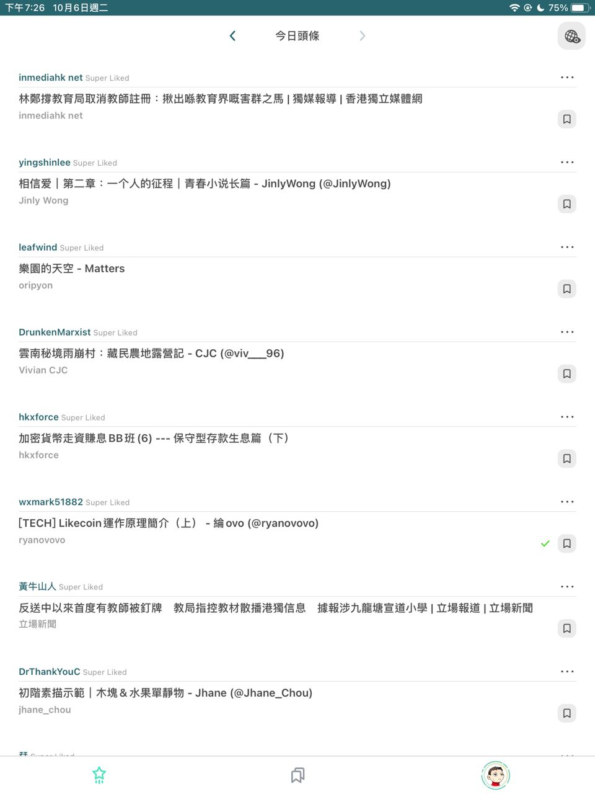
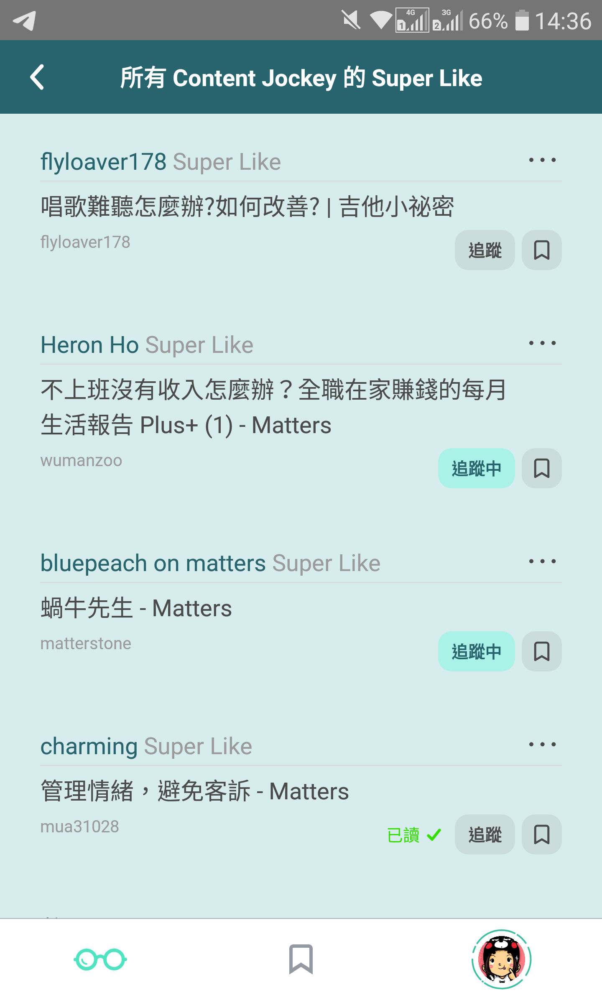
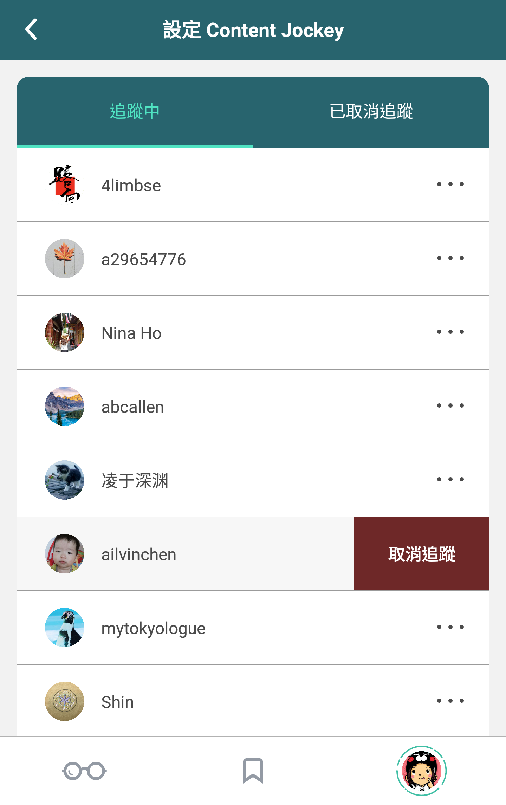

# 今日頭條

## 不是瀏覽，而是閱讀

打開 Liker Land 手機應用程式，即可看到「今日頭條」，就像以往的報紙，每天選出有限的、重要的新聞。

今日頭條由[「內容伯樂」（Content Jockey）](https://docs.like.co/v/zh/user-guide/reader/superlike)每天人手挑選，完全不使用 AI。每位內容伯樂每天只有兩個限額，一方面確保精挑細選，另方面亦確保讀者不會浸沒於內容大海。

Liker Land 預設內容伯樂由讚賞公民共和國以[流動民主](https://docs.like.co/v/zh/user-guide/liquid-democracy)治理，由社群投票選出質量高、具口碑的內容伯樂。現時，Liker Land 設有五個預設內容伯樂：

* 立場新聞：[standnews](https://like.co/standnews)
* 獨立媒體：[inmediahknet](https://like.co/inmediahknet)
* 眾新聞：[hkcitizennews](https://like.co/hkcitizennews)
* Matters：[hi176-matters](https://like.co/hi176-matters)
* 讚賞公民基金會：[foundation](https://like.co/foundation)（報告、公布、議案等）

## 追蹤內容伯樂

除預設內容伯樂以外，讀者可自行追蹤其他可信賴，關注不同範疇的內容伯樂。



## Super Like 公海 

覺得你的今日頭條不夠看？不打緊！點擊右上角的 \[地球\] 鍵，即可暢讀所有內容伯樂的 Super Like 精選文章，發堀更多精彩內容。假如你覺得他/她的品味不錯，更可點擊 \[追蹤\]，以後他/她經手 Super Like 的文章就會在你的頭條日報版面出現。

## 停止追蹤內容伯樂

若你想停止追蹤某位內容伯樂，可在 Liker Land app 選右下角的帳戶頭像，再點「設定」下的「Content Jockey」。你亦可以到 [Liker Land 網頁版](https://liker.land/settings/following/)中設定取消追蹤。

