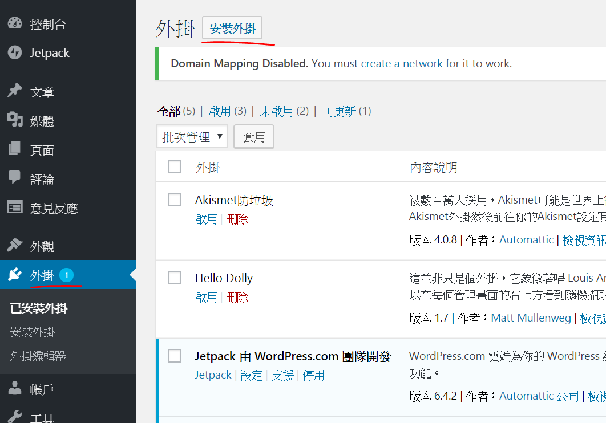

# Web3Press

過往要把文章以 NFT 形式出版，工序很䌓複：作者須先把內容及元數據儲存在如 IPFS 等分散式空間或區塊鏈上，再上傳到 NFT 市場定價出售，過程中還要入手幾款不同用途的密碼貨幣。然而現在 WordPress 的用戶有福了，因為寫完文章以後只需按一個鍵，便能完成出版 NFT 的工序，內容立即上鏈，過程只需一分鐘！

[LikeCoin Web3Press plugin](https://zh-hk.wordpress.org/plugins/likecoin/) 為古騰堡編輯器度身訂造，讓 WordPress 網站一鍵接通 Web3，實現完整的分散式出版。功能包括：

* 抓取文章的標籤和標題等內容作為 NFT 的元數據
* 一鍵發佈文章到 LikeCoin 並儲存於 IPFS 及 Arweave 分散式檔案系統並註冊 [ISCN](../general-guides/decentralized-publishing/what-is-iscn.md)
* 以 LikeCoin 一筆過支付內容上鏈及分散式儲存費用
* 鑄造 Writing NFT 後 [NFT Widget](../general-guides/writing-nft/collect-writing-nft/nft-widget.md) 自動在文章下方顯示，讓讀者[收集 NFT](../general-guides/writing-nft/collect-writing-nft/)，並整合 [LikeCoin button 讚賞鍵](creator/)功能
* 支援 [Internet Archive](https://archive.org/) 自動備份

## 如何安裝 Web3Press 

請執行以下步驟：

### 步驟一：登入 WordPress 管理員頁面

進入 WordPress 網站管理員頁面並登入（若網址是 www.abc.com ，管理員頁面一般便是 www.abc.com/wp-admin）。

### 步驟二：開始安裝

如圖點擊左方「外掛」，再點擊上方「安裝外掛」。

### 步驟三：啟用外掛

搜尋關鍵字 "LikeCoin"，找到 LikeCoin 的外掛，點擊「立即安裝」並等待完成，再點擊「啟用」。

<figure><figcaption></figcaption></figure>

<figure><figcaption></figcaption></figure>

### 步驟四：完成安裝

安裝完成後，你會發現在左方的菜單中多了一個 "LikeCoin" 的選項。恭喜你，你已經完成安裝了！

<figure><figcaption></figcaption></figure>

## 以 Keplr 簽署發佈 Writing NFT

在出版 Writing NFT 前請安裝 [Keplr 瀏覽器擴充功能](../general-guides/wallet/keplr/)並登入。此外亦需要少量 LikeCoin 進行操作，新用戶可使用[水龍頭](../general-guides/faucet.md)獲得少量 LikeCoin，或查看[購買 LikeCoin](../general-guides/trade/buy-likecoin.md) 的方式。

留意用戶並不需要註冊 Liker ID 也可以使用 Web3Press 去中心出版。

### 步驟一：註冊 ISCN

發佈文章後，在 Decentralized Publishing 底下點「Publish」。

<figure><figcaption></figcaption></figure>

彈出視窗，點「Next」。

<figure><figcaption></figcaption></figure>

彈出 Keplr 視窗開始將內容上載到 IPFS 及 Arweave，點「Approve」。

<figure><figcaption></figcaption></figure>

上載途中請不要關閉視窗。

<figure><figcaption></figcaption></figure>

接下來將內容元資料註冊到 LikeCoin chain，在 Keplr 視窗點「Approve」。

<figure><figcaption></figcaption></figure>

註冊途中請不要關閉視窗。

<figure><figcaption></figcaption></figure>

### 步驟二：鑄造 Writing NFT

ISCN 經已成功註冊，點「Continue to mint Writing NFTs」鑄造 Writing NFT。

<figure><figcaption></figcaption></figure>

預覽你的 Writing NFT，如需添加或更改 Writing NFT 的封面可按「:pencil2:」，如不需更改 / 文章沒有圖片，將顯示文章預設的 OG 圖 / 不顯示圖片，完成後按「Next」。

<figure><figcaption></figcaption></figure>

亦可為你的 Writing NFT 輸入作者的話，按「Add message to your collectors」並輸入訊息，完成後按「Next」繼續。

<figure><figcaption></figcaption></figure>

彈出 Keplr 視窗數次以鑄造 Writing NFT，全部按「Approve」。

<figure><figcaption></figcaption></figure>

### 步驟三：完成發佈

出現 Complete! 頁面代表經已成功鑄造，點「View NFT」預覽你的 Writing NFT。

<figure><figcaption></figcaption></figure>

<figure><figcaption></figcaption></figure>

你也可以到 Liker Land 我的書架查看你的創作。

<figure><figcaption></figcaption></figure>

## 設定 Liker ID 

設定前請先[註冊 Liker ID](liker-id/)。

在管理介面左方菜單，點選 "LikeCoin" 外掛設定，再選「Liker ID」。在右方畫面中，輸入 Liker ID 並點「Confirm」：

<figure><figcaption></figcaption></figure>

<figure><figcaption></figcaption></figure>

* Website Liker ID - 假如網站有多於一個作者，設定 Website Liker ID 後將於沒有設置 Liker ID 的作者文章顯示這個 Liker ID。
* You Liker ID - 設定你自己的 Liker ID。而成功新增 WordPress 網站新使用者後，新用戶以自己的 WordPress 帳號登入，便可設定自己的 Liker ID 並顯示自己的 NFT Widget / 讚賞鍵。

<figure><figcaption></figcaption></figure>

## 更多有用功能 

### Publish to Internet Archive

填寫 Internet Archive S3 API Key 後即可於發佈文章時同步到 Internet Archive。

<figure><figcaption></figcaption></figure>

### Publish to Matters 

由現在開始你可以把 WordPress 網站的文章同步到 Matters。只需簡單登入你的 Matters 電郵 ( Matters login email ) 及密碼 ( Password ) 再按「Login」即可完成設定。

撰寫文章時有三個選項：

* 自動儲存草稿到 Matters ( Auto save draft to Matters ) － 文章草稿將同步到你的 Matters 草稿箱。
* 自動發佈文章至 Matters ( Auto publish post to Matters )－ 當你在 WordPress 網站發佈文章時，該文章亦會同時於 Matters 發佈。
* 在頁尾增加原文鏈結 ( Add post link in footer ) － 在 Matters 文章中加入 WordPress 文章的原文鏈結。

<figure><figcaption></figcaption></figure>

在 Matters 上發布的作品皆會被上載到星際文件系統（InterPlanetary File System，IPFS）的節點之上。

### Web Monetization

啟用 Web monetization，[Coil](https://coil.com/) 訂戶訪問網站時可得到打賞。

<figure><figcaption></figcaption></figure>

## 其他設定

<figure><figcaption></figcaption></figure>

### LikeCoin Widget

* Show in Posts：設定 Liker ID 後，預設為顯示 NFT Widget / 讚賞鍵於網站文章的下方
* Show in Pages：於 WordPress 頁面中顯示讚賞鍵


#### 於任何位置顯示 NFT Widget / 讚賞鍵 

你可使用短代碼 \[likecoin] 在文章中任何位置顯示額外的 NFT Widget / 讚賞鍵。


#### 廷伸閱讀[&#xD;](https://coralive.site/likecoin-wordpress%E4%B8%8A%E5%A6%82%E4%BD%95%E5%AE%89%E8%A3%9D%E8%A8%AD%E5%AE%9Alikecoin/) 

> [請人幫忙分享、留言、拍手的好東西：「可重複使用區塊」](https://xrine.com/gutenburg-%E5%8F%AF%E9%87%8D%E8%A4%87%E4%BD%BF%E7%94%A8%E5%8D%80%E5%A1%8A/)

> [如何在 Medium 和 WordPress 設置錨點 (Anchor)](https://bchai.cc/2019/03/30/how-to-setup-anchor-medium-wordpress/)

### ISCN Badge 

文章註冊 ISCN 後，可設定是否展示 ISCN badge。狀態分為不展示 ( Not shown )、正常模式 ( Light Mode ) 及深色模式 ( Dark Mode )，選擇後點「Confirm」確認。

### LikeCoin widget advanced settings

自訂每篇網站文章的 NFT Widget / 讚賞鍵顯示設置。

<figure><figcaption></figcaption></figure>
