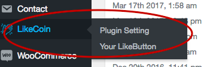
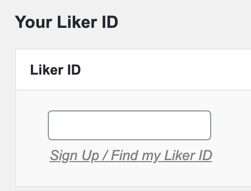
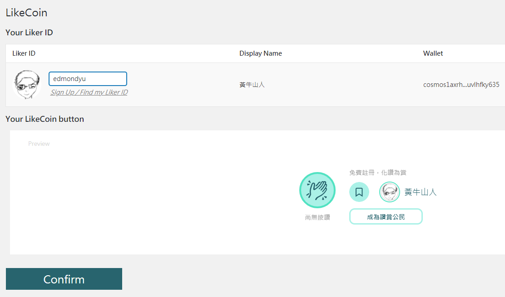
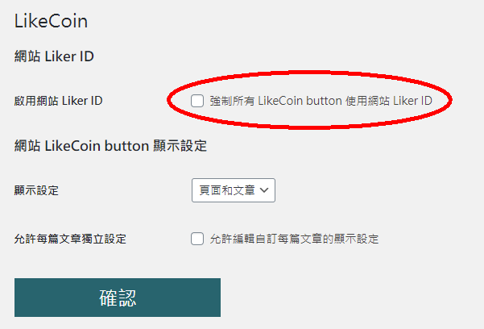
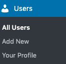
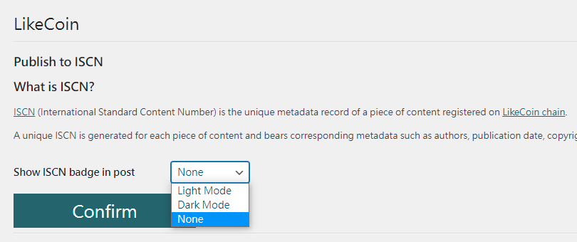
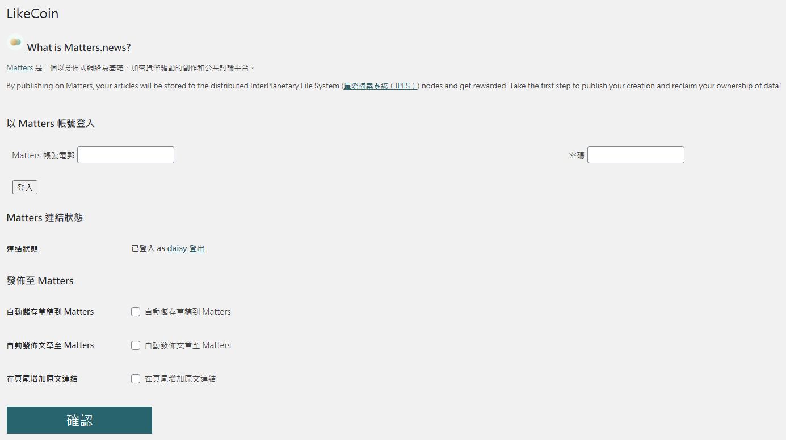

# WordPress

過往要把文章以 NFT 形式出版，工序很䌓複：作者須先把內容及元數據儲存在如 IPFS 等分散式空間或區塊鏈上，再上傳到 NFT 市場定價出售，過程中還要入手幾款不同用途的密碼貨幣。然而現在 WordPress 的用戶有福了，因為寫完文章以後只需按一個鍵，便能完成出版 NFT 的前置工序，內容立即上鏈，過程只需一分鐘！

[LikeCoin Writing NFT WordPress plug-in](https://zh-hk.wordpress.org/plugins/likecoin/) 為古騰堡編輯器度身訂造，讓 WordPress 網站一鍵接通 Web3。功能包括：

* 一鍵發佈文章到 LikeCoin 並儲存於 IPFS 及 Arweave
* 以 LikeCoin 一筆過支付內容上鏈及分散式儲存費用

此 plugin 更支援進一步[鑄造 Writing NFT](../general-guides/writing-nft/writing-nft-wordpress-plugin.md) 並售賣給讀者，實現完整的分散式出版。

## 安裝 LikeCoin 外掛 

然後請執行以下步驟：

步驟一：進入 WordPress 網站管理員頁面並登入（若網址是 www.abc.com ，管理員頁面一般便是 www.abc.com/wp-admin）。\
\
步驟二：如圖點擊左方「外掛」，再點擊上方「安裝外掛」。

步驟三：搜尋關鍵字 "LikeCoin"，找到 LikeCoin 的外掛，點擊「立即安裝」並等待完成，再點擊「啟用」。

.png>)

步驟四：安裝完成後，你會發現在左方的菜單中多了一個 "LikeCoin" 的選項。恭喜你，你已經完成安裝了！

## 設定 LikeCoin 外掛 

設定讚賞鍵外掛前，請先 [註冊 Liker ID](liker-id/)。

在管理介面左方菜單，點選 "LikeCoin" 外掛設定，再選「你的 Liker ID」。在右方畫面中，輸入你的 Liker ID。

在畫面下方點擊「確認」鍵，即完成設定！

完成以上步驟後，你的 NFT Widget / 讚賞鍵便會自動出現在網頁貼文的下方了。

### 於任何位置顯示 NFT Widget / LikeCoin button  

你亦可使用短代碼 \[likecoin] 在文章中任何位置顯示額外的 NFT Widget / 讚賞鍵。

## 如何於一個 WordPress 網站支援多個作者 

網站中有很多作者，各人有自己的 Liker ID，可以安裝每個作者的讚賞鍵於他們的作品中嗎？

可以的，這是預設的設定。\
\
步驟一：在 LikeCoin 外掛中的「外掛設定」分頁，有一個「啟用網站 Liker ID－強制所有 LikeCoin button 使用網站 Liker ID」的選項。請確保這選項 **\*沒有\*** 被勾選。

步驟二：接下來就是 WordPress 新增用戶的流程，跟 LikeCoin 外掛無關。成功新增用戶後，新用戶以自己的 WordPress 帳號登入，便可設定自己的 Liker ID 和 NFT Widget / 讚賞鍵。

### 廷伸閱讀[&#xD;](https://coralive.site/likecoin-wordpress%E4%B8%8A%E5%A6%82%E4%BD%95%E5%AE%89%E8%A3%9D%E8%A8%AD%E5%AE%9Alikecoin/) 

> [請人幫忙分享、留言、拍手的好東西：「可重複使用區塊」](https://xrine.com/gutenburg-%E5%8F%AF%E9%87%8D%E8%A4%87%E4%BD%BF%E7%94%A8%E5%8D%80%E5%A1%8A/)

> [如何在 Medium 和 WordPress 設置錨點 (Anchor)](https://bchai.cc/2019/03/30/how-to-setup-anchor-medium-wordpress/)

## 發佈設定 

### 發佈 ISCN 

文章註冊 ISCN 後，可設定是否展示 ISCN badge。狀態分為不展示 ( None )、正常模式 ( Light Mode ) 及深色模式 ( Dark Mode )，選擇後點「Confirm」確認。

### 發佈到 Matters 

由現在開始你可以把 WordPress 網站的文章同步到 Matters。只需簡單登入你的 Matters 電郵及密碼再撰寫文章即可啟用此功能。測試版本提供三個選項：

* 自動儲存草稿到 Matters － 文章草稿將同步到你的 Matters 草稿箱。
* 自動發佈文章至 Matters － 當你在 WordPress 網站發佈文章時，該文章亦會同時於 Matters 發佈。
* 在頁尾增加原文鏈結 － 在 Matters 文章中加入 WordPress 文章的原文鏈結。

在 Matters 上發布的作品皆會被上載到星際文件系統（InterPlanetary File System，IPFS）的節點之上。

## 把 WordPress 文章出版成 Writing NFT


[writing-nft-wordpress-plugin.md](../general-guides/writing-nft/writing-nft-wordpress-plugin.md)



使用 Writing NFT plug-in 出版 Writing NFT 後，[NFT Widget](../general-guides/writing-nft/collect-writing-nft/nft-widget.md) 自動在文章下方顯示。已安裝 Writing NFT plug-in 但沒有為文章鑄造 Writing NFT 則顯示 [LikeCoin button 讚賞鍵](creator/)。

