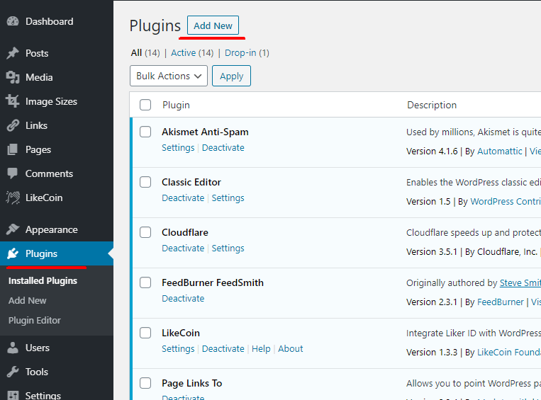
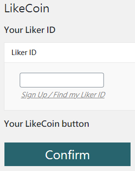
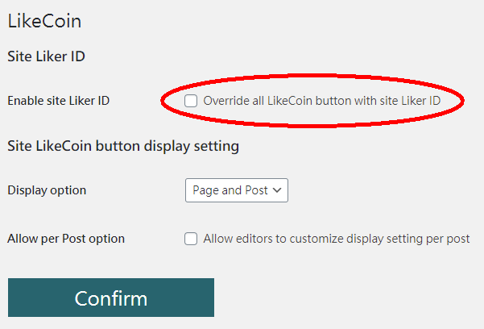
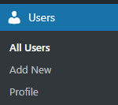
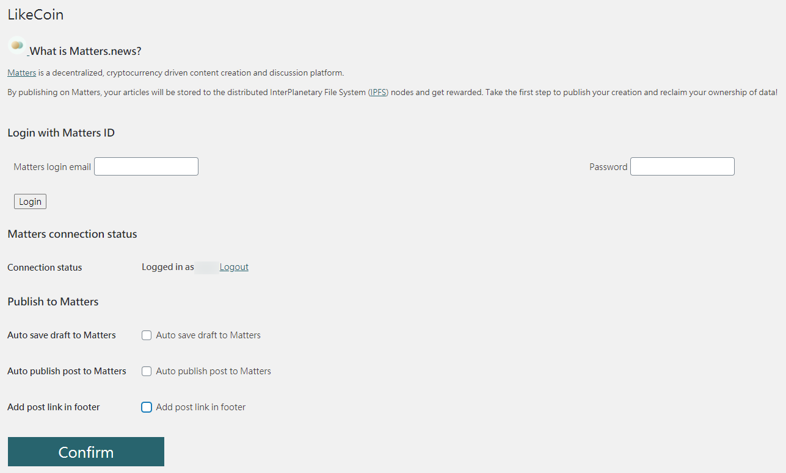

# WordPress

The current hassle to publish articles as NFTs: Creators needed to find ways to save the contents and metadata on decentralized storage such as IPFS or blockchain, before selling them on the NFT marketplaces. Furthermore, they had to purchase several kinds of cryptocurrencies during the process. We have good news for WordPress users: After finishing your articles, you only need one click to publish pre-NFT credentials to blockchain. the whole process just takes one minute to complete within the WordPress editor!

The brand new [LikeCoin WordPress plugin](https://wordpress.org/plugins/likecoin/) is tailor made for Gutenberg editor, which links up the WordPress website with Web3 by just one click. Its functions include:

* One-click publishing to LikeCoin plus storage at IPFS and Arweave
* On-chain and decentralized storage fees can be paid by LikeCoin in one go

This plugin will further support NFT minting in the future. By selling NFTs to readers, decentralized publishing can be actualized to the fullest.

## How to add LikeCoin button on WordPress

Installing [LikeCoin WordPress plugin](https://wordpress.org/plugins/likecoin/) is easy-peasy, it takes only a few steps, within one minute.

### Install LikeCoin plugin 

Follow the steps:

1\. Go to the WordPress admin panel and login ( For example if your website is www.abc.com, the admin panel address is usually on www.abc.com/wp-admin ).

2\. Click on the Menu on the left, go to "Plugin" and click on "Add New" on top.

3\. Search for "LikeCoin" and find the LikeCoin plugin, click "Instal Nowl" and wait for the system to finish the job, then click "Activate".

.png>)

4\. After installation, there will be an "LikeCoin" option in the menu. Congratulations,  installation is done!

.png>)

## Configuring LikeCoin plugin

Before configuring the LikeCoin plugin, please [register a Liker ID](liker-id/).

On the menu, select "Your LikeCoin button",  then fill in your Liker ID in the Liker ID field.

Then click "Confirm",  your LikeCoin button setup is finished.

After completing the above procedures, your LikeCoin button will appear underneath each article of your WordPress site.&#x20;

### Config LikeCoin button to appear in anywhere of the articles

You can also use shortcode \[likecoin] to display extra LikeCoin buttons.

## How to support multiple Liker ID on a WordPress site

There are many creators in one website, each of them got their own Liker ID, can LikeCoin button support rewarding individual creators?

Sure, the LikeCoin plugin supports multiple Liker ID by default.

1\. In the LikeCoin "Plugin Setting", there is an option "Enable site Liker ID - Override all LikeCoin button with site Likder ID". Please make sure that the option is "**NOT**" being selected.

2\. You can add new WordPress users as usual, and this part is not related to the LikeCoin plugin. After adding new users, they can use their own WordPress account to login and set up their own Liker ID and LikeCoin button.

## Publish Setting

### Publish to ISCN

After the article is published to ISCN, you can set it if you want to display the ISCN badge. The status is None ), Light Mode  and Dark Mode ). Select and click "Confirm".

### Publish to Matters

From now on you can sync your WordPress article to Matters. Simply login your Matters email and password then write an article, the content will be on Matters as well. There are 3 options:

* Auto save draft to Matters - Posts drafted will be sync to your Matters's draft box
  .
* Auto publish post to Matters - A copy of the post will be automatically published to Matter when you publish a post on your WordPress site.
* Add post link in footer - Link of the original WordPress post will be added to the post in Matters.

By publishing on Matters, your articles will be stored to the distributed InterPlanetary File System (IPFS) nodes.

## Tutorial: Publishing WordPress post to blockchain




