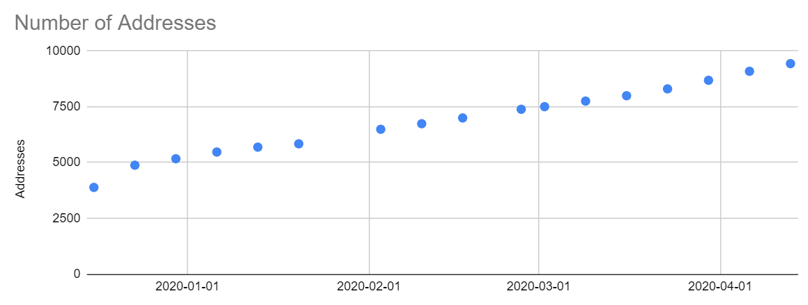
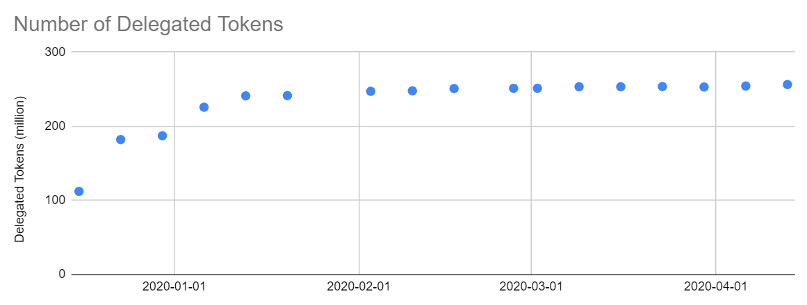
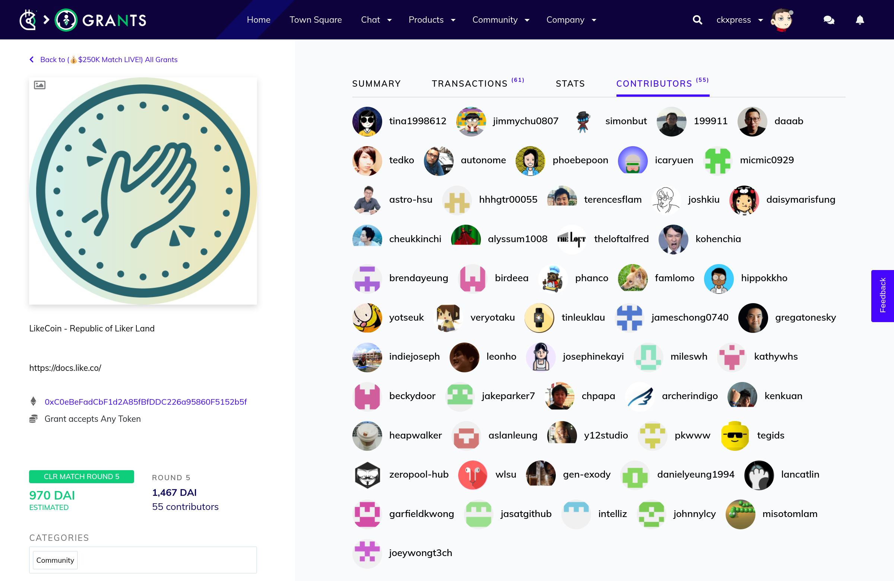

# Weekly Progress Updates

## Next Meeting: 13 April, 6PM HKT

## 

## [Chung](https://like.co/chungwu)

### LikeCoin chain statistics \(difference from 2020-04-06\)

* Historical data: [https://docs.google.com/spreadsheets/d/16vCOjhdeSwumnB9YBVLEdG-9KjJMRytwzRf6peaVGKs](https://docs.google.com/spreadsheets/d/16vCOjhdeSwumnB9YBVLEdG-9KjJMRytwzRf6peaVGKs)
* Number of addresses: 9,430 \(+344\)
* Number of transactions: 198,979 \(+19,515\)
* Number of delegated LIKE: ~256,170,000 \(+1,980,000\), 77.44% of migrated LIKE

### Works

* Implemented transaction fee part in ISCN on LikeCoin chain
* Will work on data fields and validations of ISCN record structure this week 

## [ckxpress](https://like.co/ckxpress)

* semi leave since Apr 1
* designed the [core mechanism](https://docs.google.com/presentation/d/1-qvNS5ARCkc5oAWMCMZGmFzXcbBjlYHKRMVvCq78Wvs/edit?usp=sharing) of Liker Land app, collecting feedback from community
* collecting feedback of [Likerthon](https://github.com/likecoin/likerthon) - hackathon of LikeCoin
* updated AppWorks on project status and collect feedback on project direction
* published &lt;[民主的再想像——與唐鳳談流動民主 II](https://matters.news/@ckxpress/%E6%B0%91%E4%B8%BB%E7%9A%84%E5%86%8D%E6%83%B3%E5%83%8F-%E8%88%87%E5%94%90%E9%B3%B3%E8%AB%87%E6%B5%81%E5%8B%95%E6%B0%91%E4%B8%BB-ii-bafyreiflgxoqowotorkdhgns24hznm5du2cvo3342zohwgoc5cg5s77fb4)&gt;
* wrapped up [Gitcoin grants](https://gitcoin.co/grants/634/likecoin-republic-of-liker-land) round 5 with 55 contributors, 1467 DAI donation and 970 DAI as matched funding. The grant page will stay on at Gitcoin as one of our funding source.

[**edmond**](https://like.co/edmondyu)\*\*\*\*

**statistics:**

* Facebook Ad CPA decreased by 20% to $67.88.  Tried to place AD to Chinese users in Canada, CPA on 1st day is very good \(&lt;$30\) but then increased to ~$100 after increasing the budget by 2.5 times.  The AD was temporarily suspended and will try again after the Easter holiday \(tonight\).
* Not much change in both Liker Land and LikeCoin button conversion funnel.  Weekly new Liker ID number stay around 2100+.  Weekly active Likers and Civic Likers number present a horizontal move.
* New civic liker registration: 85, has been dropping for the 2nd week since the March weekly peak 116

previous week:

* Published an article for [2020 Q1 review](https://matters.news/@likecoin/%E8%AE%9A%E8%B3%9E%E5%85%AC%E6%B0%91-2020-%E7%AC%AC%E4%B8%80%E5%AD%A3%E5%9B%9E%E9%A1%A7-bafyreifdlfznigt3htdur7e2pyomoem5chmmortz34rnakprxdipt6s2vy).
* Planned for two weeks post listing strategy and schedule
* Social Media: Daisy started the community activity [LikeCoin 狂想曲](https://matters.news/@daisy/matters-%E7%A4%BE%E5%8D%80%E5%9F%BA%E9%87%91%E9%85%8D%E6%8D%90%E6%8F%90%E6%A1%88-like-coin-%E7%8B%82%E6%83%B3%E6%9B%B2-bafyreiftbuickqne5bosrwweerr4znzsmhoygyipzlcv222l5glsekjvcm) on Matters
* App promotion plan for Q2

this week:

* Continue on Crisp migration
* Engage top influencers
* Follow up with Inmedia for those authors already owning a Liker ID
* Execution of Advertising plan on FB
* Resume Liker Land/LikeCoin button A/B test

Social Media \(executed by community helper Daisy\)

* Facebook reach was down this week to 1028 \(prevous week 1819\) and engagement rate 5% \(previous week 6%\). Compared to last week that we had "super hot post Audrey Tang", this week's performance is back to "regular" as 2020 Q1 figures sharing started, which is much more "boring" in a sense.
*  Created a project in the Matters Million campaign to [collect crazy Likercoin usage ideas](https://matters.news/@daisy/like-coin-%E6%96%B0%E6%89%8B%E6%9D%91-%E4%B8%8D%E6%96%B7%E6%9B%B4%E6%96%B0-%E8%AB%8B%E7%9C%8B%E7%95%99%E8%A8%80-zdpuAwHNTynzTx2Vi3Q487FNjSsacmzkRoiWpPjFgydW2gy6y) from Likers, total 32,825 LikeCoin raised. Project end day 30/4.

