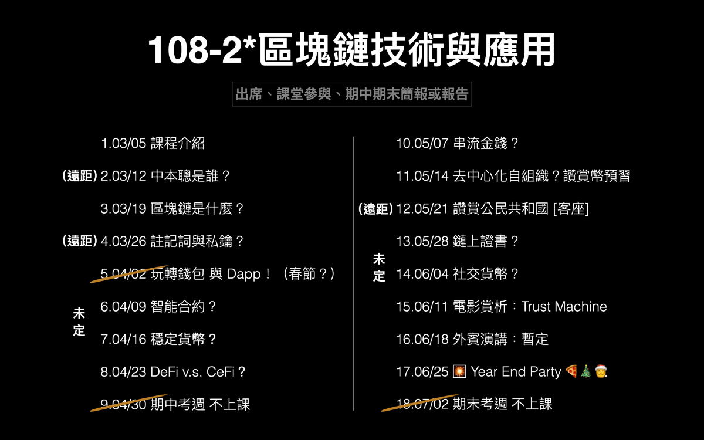

# 2020.05.25

## [Chung ](https://like.co/chungwu)\(Blockchain developer\)

### LikeCoin chain statistics

### Last week

* 
### This week

* 
## [Michael](httsp://like.co/michaelcheung) \(Developer\)

### Last week

* 
### This week

* 
## [William](https://like.co/williamchong007) \(Full Stack Developer\)

### Last week

* 
### This week

* 
## [David Ng](https://github.com/nwingt) \(Frontend Developer\)

### Last Week

* \*\*\*\*[**like.co**](https://like.co)
  * Updated Like Pay UI
* Liker Land App
  * Implemented other websites sign-in
  * Added app rating

### This Week

* [**like.co**](https://like.co)\*\*\*\*
  * Some minor tweaks
  * Assist on Liquid Quick Exchange integration
* LikeCoin button
  * UI v2 coding
* Liker Land App
  * Release v0.18.0

## [E**dmond**](https://like.co/edmondyu) **\(Operations & Marketing\)**

### **Statistics**

### **Last week**

* 
### This week

* 

## [Phoebe](https://like.co/phoebe_fb) \(Community & Business Development\) 

* 1st meeting with SIE fund impact incubator. Submitted revised proposal to prepare for panel screening. 
* Applied to Media-X, Digital Defenders Partnership [Sustainable Protection Funding](https://www.digitaldefenders.org/funding/sustainable-protection-funding/)
* Attended [g0v hackathon39n第參拾玖次又在家黑客松](https://docs.google.com/spreadsheets/d/1FZag4UTdaVUfdjBiVACRceoWhqTTGrW-fTHok_cYgkI/edit?pli=1#gid=1). Completed a 3 mins and 8 minis presentation on promoting Likerthon and Introduction to LikeCoin 
* Promote [Likerthon ](https://github.com/likecoin/likerthon)with the effort of Edmond and community helper. Might need to consider postpone Likerthon deadline.

## [Joshkiu](https://like.co/joshkiu) \(UX Designer\)

### Last week

* 
### This week

* 
## [Aludirk](https://like.co/aludirk) \(System Architect\) 

### Last week

### This week

## [ckxpress](https://like.co/ckxpress) \(Product Designer\) 

* did a guest lecture at NTUT re LikeCoin. response was good with 60ish people

* read the whole blog of Argent and will conduct a sharing, with highlights on what we might learn from it
* assisted in D-biz \(will stop the initiative\), Media-X, Digital Defenders Partnership [Sustainable Protection Funding](https://www.digitaldefenders.org/funding/sustainable-protection-funding/)
* copy writing on Liker Land:
  * **Liker Land - social reading**
  * Browse less. Read more.
  * Like less. Reward more.
  * Share less. Inspire more.
  * 不是瀏覽，而是閱讀。
  * 不是讚好，而是讚賞。
  * 不是分享，而是啟發。

